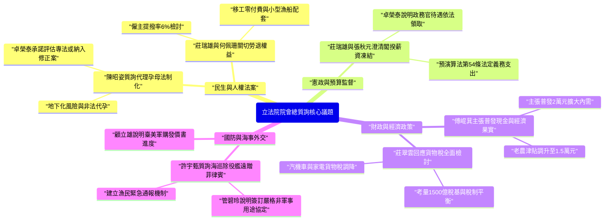

# 2026-10-02 (立法院 / 行政院) 立法院院會總質詢

## 超簡短介紹
- 陳昭姿委員質詢行政院院長卓榮泰關於代理孕母法制化，指出禁止政策導致地下化與非法代孕猖獗，要求行政院評估專法或含代孕草案。
- 莊瑞雄委員針對行政院院長卓榮泰薪資凍結案進行澄清，行政院人事行政總處張秋元副人事長說明政務官薪水屬法定義務支出，依法得以正常領取。
- 傅崐萁委員主張普發現金兩萬元共享經濟成長，並要求財政部部長莊翠雲全面檢討汽機車及家電貨物稅、調升老農津貼至 1.5 萬元。
- 許宇甄委員關切海巡除役艦艇遠贈菲律賓是否影響護漁安全，海委會主委管碧玲說明已簽訂嚴格非軍用及不對付臺灣漁船之協議。
- 待辦事項：研議代孕法制化時程、檢討貨物稅減免規模、建立遠贈海巡艦艇違約監督機制及外籍移工零付費評估。

## 基本資訊
- **日期與時間**：2026 年 10 月 02 日
- **出席人員**：韓國瑜主席（立法院院長）、卓榮泰院長（行政院院長）、周萬來秘書長（立法院秘書長）、張秋元副人事長（行政院人事行政總處）、陳昭姿委員、範雲委員、傅崐萁委員、莊瑞雄委員、許宇甄委員、管碧玲主委（海洋委員會）、陳駿季部長（農業部）、何佩珊部長（勞動部）、顧立雄部長（國防部）、莊翠雲部長（財政部）、陳世凱部長（交通部）、郭智輝部長（經濟部）。
- **會議摘要**：本節會議為立法院第 11 屆第 2 會期院會總質詢，聚焦代理孕母法制化與地下化亂象、閣揆薪資凍結案之憲政法理爭議、經濟成長果實普發兩萬與貨物稅改革、海巡除役艦遠贈菲律賓之護漁安全，以及臺美對等貿易協定（ART）下外籍移工招募零付費對小型漁船僱主的衝擊配套。

## 完整時序摘要

- **[30:00 - 43:00] 報告事項宣讀與程式處理**
  - 院會由宣讀員依序宣讀各委員會審查草案、行政院與各主管機關 116 年度預算案、決議報告案及函送案件。
  - 主席韓國瑜宣告報告事項處理完畢，並由秘書長周萬來報告官員請假狀況後，隨後展開施政質詢。

- **[44:00 - 61:00] 陳昭姿委員質詢：代理孕母法制化與地下化亂象**
  - 引用美國 Lady Gaga 尋求代孕案例與臺灣臺中地檢署破獲跨國非法代孕案件，向行政院院長卓榮泰強調一昧禁止只會造成地下化與缺乏人權保障。
  - 要求行政院重視子宮缺損與不孕婦女權利，向前政委張景森及醫界專家請益，承諾提出包含代孕在內的人工生殖法草案或專法。

- **[61:00 - 75:00] 陳昭姿委員質詢：司法人力、臺中港填海及中油三接**
  - 質疑檢察與監所人力嚴重不足，要求張秋元副人事長研議彈性調整預算員額與修正總員額法；卓榮泰院長承諾支援增加預算員額。
  - 針對臺中港大填海計畫涉及白海豚重要棲地，要求實施環評與野生動物重要棲地審查；經濟部部長郭智輝回應中油三接相關程式均依最高行政法院判決合法處理。

- **[100:00 - 129:00] 傅崐萁委員質詢：經濟果實共享、貨物稅與老農津貼**
  - 向卓榮泰院長主張人均 GDP 大幅成長下，應普發現金兩萬元（總計約 4,600 億元）擴大內需、照顧庶民。
  - 指出日本早於 1978 年即停徵汽車貨物稅，要求財政部部長莊翠雲全面取消或大幅調降汽機車、家電及冷氣等貨物稅。
  - 訴求老農津貼應隨人均 GDP 成長比例調高至每月 15,000 元，並向交通部部長陳世凱關切蘇花安發包與動工時程。

- **[135:00 - 158:00] 莊瑞雄委員質詢：貨物稅衝擊、閣揆薪資案與美規車安全**
  - 邀請財政部部長莊翠雲澄清若全面廢除貨物稅將導致每年減少 1,500 億元稅基，恐引發營業稅調漲與物價波動。
  - 邀請張秋元副人事長說明政務官待遇為預演算法第 54 條之法定義務支出，立法院預算凍結決議不影響卓榮泰院長依法領取薪資。
  - 關切美規車輛零關稅進口後，紅燈方向燈與臺灣橘黃燈規範之混和車流交通安全，要求交通部部長陳世凱評估法規調和；並要求勞動部部長何佩珊研議勞退提撥率由 6% 向上提升。

- **[158:00 - 184:00] 許宇甄委員質詢：海巡遠贈菲律賓、移工零付費與軍購進度**
  - 質疑海巡除役艦整修後遠贈菲律賓恐有對峙臺灣漁船風險，海委會主委管碧玲說明已簽署非軍事用途與不得對付臺灣漁船之條款，並可隨時要求撤銷返還。
  - 針對臺美對等貿易協定（ART）要求三年內達成移工零付費，質疑增加小型漁船僱主負擔，要求勞動部部長何佩珊與農業部部長陳駿季於年底前提出透明費用明細、分級補助與分期支付配套。
  - 國防部部長顧立雄回應臺美軍購專案小組運作正常，第二批發價書持續與美方進行綿密協調。

## 待辦事項

| 專案 | 主辦單位 | 說明與具體要求 |
| :--- | :--- | :--- |
| 代孕法制化評估 | 衛福部、行政院（卓榮泰院長） | 收集各國立法例，邀集醫界與專家溝通，評估推動專法或提出含代孕之《人工生殖法》修正草案。 |
| 司法與監所員額研議 | 張秋元副人事長（人事總處）、法務部 | 針對地檢署與監所人力吃緊問題，研議增加預算員額，並重新評估《總員額法》彈性條款之動用。 |
| 臺中港填港環評審查 | 陳世凱部長（交通部）、環境部、管碧玲主委（海委會） | 評估臺中港填海造路計畫對白海豚重要棲地之影響，補齊相關生態審查與保護程式。 |
| 貨物稅稅制大規模檢討 | 莊翠雲部長（財政部） | 評估汽機車、家電及冷氣等貨物稅調降規模，兼顧租稅公平、節能減碳政策與地方統籌分配稅款影響。 |
| 美規車輛方向燈規範安全檢討 | 陳世凱部長（交通部） | 針對美規車零關稅進口後，紅色方向燈與橘黃色方向燈之混和車流造事率進行評估，適時檢討法規。 |
| 勞退提撥率提高可行性 | 何佩珊部長（勞動部） | 研議勞工退休金僱主提撥率由 6% 向上調整之可行性，並鼓勵勞資雙方自願提撥。 |
| 遠贈海巡艦艇履約監督與通報 | 管碧玲主委（海洋委員會） | 建立遠贈菲律賓除役艦艇之違約撤銷與返還機制，並提供臺灣漁民海上緊急通報視窗與專責救援能量。 |
| 移工零付費配套機制 | 何佩珊部長（勞動部）、陳駿季部長（農業部） | 於年底前公佈來源國招募費用透明明細，針對小型漁船僱主研議試算分級補助、分期支付與退費遞補規範。 |

## 重點彙整與深度分析

以下為本次立法院院會總質詢之核心議題與部會回應架構：



### 一、代理孕母法制化與地下化亂象
陳昭姿委員強烈呼籲行政院院長卓榮泰正視不孕症與子宮缺損婦女的需求。質詢中指出，美國等先進國家已有成熟的代孕制度，而臺灣目前全面禁止的現狀，反倒促成地下化跨國代孕與詐欺亂象（如臺中地檢署破獲的非法跨國代孕案）。一味禁止無法消除需求，反而讓孕母、委託父母與嬰兒皆缺乏法律保障。卓榮泰院長回應表示，政府尊重生命與生育訴求，將全面收集各國立法例，並承諾積極尋求社會更大共識與研議討論機制。

### 二、閣揆薪資凍結爭議與預算監督界線
莊瑞雄委員針對先前立法院透過凍結行政院院長卓榮泰薪資案提出質疑，指出此舉涉及國會監督權與預算審查的界線。行政院人事行政總處張秋元副人事長說明，依據《預演算法》第 54 條，政務人員與公務員薪資屬「法定義務支出」，即使總預算案遭遇延宕或凍結附加條件，依法仍得領取待遇。卓榮泰院長表示，個人尊重立法院，但更須守護法律體制與公務體系尊嚴，避免中央與地方政府因政黨對立而產生俸祿被無端扣留之惡例。

### 三、經濟成長指標、貨物稅改革與普發兩萬爭議
傅崐萁委員向卓榮泰院長主張近年臺積電與 AI 產業帶動經濟大幅成長、人均 GDP 達 4.5 萬美元，但貧富差距與物價上漲使基層庶民無感，提出應普發現金兩萬元（約 4,600 億元）以發揮乘數效果振興國旅與內需；並指責政府至今仍對汽機車、冷氣、家電課徵高額貨物稅，落後國際標準。
莊瑞雄委員與財政部部長莊翠雲則澄清，貨物稅每年貢獻約 1,500 億元稅基（其中 10% 為地方統籌分配稅款），且目前多項家電與電動車已實施減免或退稅；若驟然全面廢除，恐需調高營業稅補足缺口，反而推升物價衝擊基層。

### 四、海巡除役艦艇遠贈菲律賓與護漁保障機制
許宇甄委員針對政府規劃將海巡除役艦整修後遠贈菲律賓表達深切擔憂，提醒不可忘記廣大興 28 號事件之歷史教訓，質疑該艦未來是否會轉為菲律賓驅趕臺灣漁船的工具。海委會主委管碧玲強調，贈艦協議設有嚴格規範，限於海難搜救與海洋保育等民用目的，絕不可武裝或用於對付臺灣漁船；若菲方違反條約，臺灣有權隨時要求撤銷協議並返還艦艇。

### 五、臺美貿易協定移工零付費與小型漁船配套
因應臺美對等貿易協定（ART）要求於三年內達成製造業與漁勞業招募「零付費」（完全由僱主負擔招募費用），許宇甄委員指出目前國內小型沿近海漁船僱主負擔沉重，要求明確制定招募規費透明化標準與逃逸退費機制。農業部部長陳駿季與勞動部部長何佩珊回應，正全面調查各來源國（如印尼、越南）之中介收費明細，將於年底前公佈合理費用區間，並研議分期支付與協助培訓配套，確保接軌國際人權規範之同時保障臺灣漁民生存權。

---

# 附件：完整逐字稿

[00:00] **?**：⟦GAP 00:00–30:00⟧ 這一段 AI 無法聽寫，已略過，不計費
[30:00] **院會宣讀員**：17，委員林淑芬等擬具行政法院組織法刪除第20條條文草案，擬交司法及法制委員會審查，宣讀完畢。
[30:01] **會議主席**：擬照透過，下一案。
[30:03] **院會宣讀員**：18，委員林淑芬等擬具行政法院組織法刪除第38條條文草案，擬交司法及法制委員會審查，宣讀完畢。
[30:09] **會議主席**：擬照透過，下一案。
[30:10] **院會宣讀員**：19，委員林淑芬等擬具法院組織法刪除第95條條文草案，擬交司法及法制委員會審查，宣讀完畢。
[30:17] **會議主席**：擬照透過，下一案。
[30:18] **院會宣讀員**：20，委員林淑芬等擬具少年及家事法院組織法刪除第44條條文草案，擬交司法及法制委員會審查，宣讀完畢。
[30:25] **會議主席**：擬照透過，下一案。
[30:26] **院會宣讀員**：21，委員林淑芬等擬具智慧財產及商業法院組織法刪除第37條條文草案，擬交司法及法制委員會審查，宣讀完畢。
[30:33] **會議主席**：擬照透過，下一案。
[30:34] **院會宣讀員**：22，委員陳靜敏等擬具護理師法部分條文修正草案，擬交社會福利及衛生環境委員會審查，宣讀完畢。
[30:41] **會議主席**：擬照透過，下一案。
[30:42] **院會宣讀員**：23，委員陳秀寳等擬具老人福利法第22條條文修正草案，擬交社會福利及衛生環境委員會審查，宣讀完畢。
[30:49] **會議主席**：報告院會，針對第23案，國民黨黨團提要改交二讀與相關提案併案協商，請問院會有無異議？（無異議）本案改交二讀與相關提案併案協商，下一案。
[31:06] **院會宣讀員**：24，委員廖偉翔等擬具法院組織法部分條文修正草案，擬交司法及法制委員會審查，宣讀完畢。
[31:12] **會議主席**：擬照透過，下一案。
[31:13] **院會宣讀員**：25，委員賴士葆等擬具中華民國刑法部分條文修正草案，擬交司法及法制委員會審查，宣讀完畢。
[31:19] **會議主席**：擬照透過，下一案。
[31:20] **院會宣讀員**：26，委員翁曉玲等擬具醫師法第11條條文修正草案，擬交社會福利及衛生環境委員會審查，宣讀完畢。
[31:26] **會議主席**：擬照透過，下一案。
[31:27] **院會宣讀員**：27，委員黃捷等擬具兒童及少年性剝削防制條例部分條文修正草案，擬交社會福利及衛生環境、司法及法制兩委員會審查，宣讀完畢。
[31:35] **會議主席**：擬照透過，下一案。
[31:36] **院會宣讀員**：28，委員羅明才等擬具離島建設條例第15條之1條文修正草案，擬交經濟委員會審查，宣讀完畢。
[31:42] **會議主席**：擬照透過，下一案。
[31:43] **院會宣讀員**：29，委員徐巧芯等擬具陸海空軍軍官士官服役條例第29條及第61條條文修正草案，擬交外交及國防委員會審查，宣讀完畢。
[31:52] **會議主席**：擬照透過，下一案。
[31:53] **院會宣讀員**：30，委員徐巧芯等擬具志願士兵服役條例第6條之1及第16條條文修正草案，擬交外交及國防委員會審查，宣讀完畢。
[32:01] **會議主席**：擬照透過，下一案。
[32:02] **院會宣讀員**：31，委員徐巧芯等擬具陸海空軍軍官士官服役條例第9條之1及第22條條文修正草案，擬交司法及法制、外交及國防兩委員會審查，宣讀完畢。
[32:11] **會議主席**：擬照透過，下一案。
[32:12] **院會宣讀員**：32，國民黨黨團擬具全民共享經濟成果特別條例草案，擬交財政委員會審查，宣讀完畢。
[32:19] **會議主席**：擬照透過，下一案。
[32:20] **院會宣讀員**：33，行政院、司法院函送中華民國刑法第77條及第79條之1條文修正草案，及中華民國刑法施行法部分條文修正草案案，擬交司法及法制委員會審查，宣讀完畢。
[32:32] **會議主席**：擬照透過，下一案。
[32:33] **院會宣讀員**：34，行政院函送國民體育法修正草案案，擬交教育及文化委員會審查，宣讀完畢。
[32:38] **會議主席**：擬照透過，下一案。
[32:39] **院會宣讀員**：35，行政院函送116年度中央政府總預算案，含附屬單位預算及綜計表、營業及非營業部分案，擬請院會定期舉行會議，邀請行政院院長、主計長、財政部部長列席報告116年度施政計畫及116年度中央政府總預算案編製經過並備質詢，宣讀完畢。
[32:58] **會議主席**：擬照透過，下一案。
[32:59] **院會宣讀員**：36，行政院函送115年度中央政府總預算追加預算案案，擬請院會定期舉行會議，邀請行政院院長、主計長及財政部部長列席報告編製經過並備質詢，宣讀完畢。
[33:13] **會議主席**：擬照透過，下一案。
[33:14] **院會宣讀員**：37，行政院函送財團法人國防工業發展基金會116年度預算書案，擬交外交及國防委員會審查，宣讀完畢。
[33:21] **會議主席**：擬照透過，下一案。
[33:22] **院會宣讀員**：38，行政院函送財團法人工業技術研究院116年度預算書案，擬交經濟委員會審查，宣讀完畢。
[33:28] **會議主席**：擬照透過，下一案。
[33:29] **院會宣讀員**：39，行政院函送財團法人中華經濟研究院116年度預算書案，擬交經濟委員會審查，宣讀完畢。
[33:35] **會議主席**：擬照透過，下一案。
[33:36] **院會宣讀員**：40，行政院函送財團法人國家衛生研究院116年度工作計畫及收支預算案，擬交社會福利及衛生環境委員會審查，宣讀完畢。
[33:45] **會議主席**：擬照透過，下一案。
[33:46] **院會宣讀員**：41，大陸委員會函送財團法人臺港經濟文化合作策進會116年度預算書案，擬交內政委員會審查，宣讀完畢。
[33:53] **會議主席**：擬照透過，下一案。
[33:54] **院會宣讀員**：42，大陸委員會函送財團法人海峽交流基金會116年度預算書案，擬交內政委員會審查，宣讀完畢。
[34:01] **會議主席**：擬照透過，下一案。
[34:02] **院會宣讀員**：43，內政部函送國家住宅及都市更新中心116年度預算書案，擬交內政委員會審查，宣讀完畢。
[34:08] **會議主席**：擬照透過，下一案。
[34:09] **院會宣讀員**：44，內政部函送財團法人228事件紀念基金會等8家財團法人116年度預算書案，擬交內政委員會審查，宣讀完畢。
[34:17] **會議主席**：擬照透過，下一案。
[34:18] **院會宣讀員**：45，原住民族委員會函送財團法人原住民族文化事業基金會及財團法人原住民族語言研究發展基金會116年度預算書案，擬交內政委員會審查，宣讀完畢。
[34:28] **會議主席**：擬照透過，下一案。
[34:29] **院會宣讀員**：46，僑務委員會函送財團法人海華文教基金會及財團法人海外信用保證基金116年度預算書案，擬交外交及國防委員會審查，宣讀完畢。
[34:39] **會議主席**：擬照透過，下一案。
[34:40] **院會宣讀員**：47，外交部函送財團法人國際合作發展基金會、財團法人臺灣民主基金會及財團法人太平洋經濟合作理事會中華民國委員會116年度預算書案，擬交外交及國防委員會審查，宣讀完畢。
[34:53] **會議主席**：擬照透過，下一案。
[34:54] **院會宣讀員**：48，國防部函送財團法人國防安全研究院116年度預算書案，擬交外交及國防委員會審查，宣讀完畢。
[35:01] **會議主席**：擬照透過，下一案。
[35:02] **院會宣讀員**：49，國防部函送國家中山科學研究院116年度預算書案，擬交外交及國防委員會審查，宣讀完畢。
[35:08] **會議主席**：擬照透過，下一案。
[35:09] **院會宣讀員**：50，經濟部函送耀華玻璃股份有限公司管理委員會116年度預算書案，擬交經濟委員會審查，宣讀完畢。
[35:16] **會議主席**：擬照透過，下一案。
[35:17] **院會宣讀員**：51，經濟部函送財團法人中國生產力中心等20家財團法人116年度預算書案，擬交經濟委員會審查，宣讀完畢。
[35:25] **會議主席**：擬照透過，下一案。
[35:26] **院會宣讀員**：52，農業部函送財團法人中華民國對外漁業合作發展協會等21家財團法人116年度預算書案，擬交經濟委員會審查，宣讀完畢。
[35:34] **會議主席**：擬照透過，下一案。
[35:35] **院會宣讀員**：53，金融監督管理委員會函送財團法人臺灣金融研訓院等7家財團法人116年度預算書案，擬交財政委員會審查，宣讀完畢。
[35:44] **會議主席**：擬照透過，下一案。
[35:45] **院會宣讀員**：54，文化部函送國家表演藝術中心、文化內容策進院、國家電影及視聽文化中心116年度預算書案，擬交教育及文化委員會審查，宣讀完畢。
[35:54] **會議主席**：擬照透過，下一案。
[35:55] **院會宣讀員**：55，文化部函送財團法人國家文化藝術基金會等12家財團法人116年度預算書案，擬交教育及文化委員會審查，宣讀完畢。
[36:05] **會議主席**：擬照透過，下一案。
[36:06] **院會宣讀員**：56，國家科學及技術委員會函送國家災害防救科技中心及國家太空中心116年度預算書案，擬交教育及文化委員會審查，宣讀完畢。
[36:15] **會議主席**：擬照透過，下一案。
[36:16] **院會宣讀員**：57，國家科學及技術委員會函送財團法人國家實驗研究院及財團法人國家同步輻射研究中心116年度預算書案，擬交教育及文化委員會審查，宣讀完畢。
[36:27] **會議主席**：擬照透過，下一案。
[36:28] **院會宣讀員**：58，教育部函送財團法人大學入學考試中心基金會等10家財團法人116年度預算書案，擬交教育及文化委員會審查，宣讀完畢。
[36:37] **會議主席**：擬照透過，下一案。
[36:38] **院會宣讀員**：59，核能安全委員會函送國家原子能科技研究院116年度預算書案，擬交教育及文化委員會審查，宣讀完畢。
[36:45] **會議主席**：擬照透過，下一案。
[36:46] **院會宣讀員**：60，核能安全委員會函送財團法人中華民國輻射防護協會及財團法人核能資訊中心116年度預算書案，擬交教育及文化委員會審查，宣讀完畢。
[36:56] **會議主席**：擬照透過，下一案。
[36:57] **院會宣讀員**：61，交通部函送財團法人臺灣郵政協會等8家財團法人116年度預算書，及財團法人臺灣觀光協會115年度預算書案，擬交交通委員會審查，宣讀完畢。
[37:09] **會議主席**：擬照透過，下一案。
[37:10] **院會宣讀員**：62，數位發展部函送國家資通安全研究院116年度預算書案，擬交交通委員會審查，宣讀完畢。
[37:16] **會議主席**：擬照透過，下一案。
[37:17] **院會宣讀員**：63，數位發展部函送財團法人電信技術中心及財團法人臺灣網路資訊中心116年度預算書案，擬交交通委員會審查，宣讀完畢。
[37:26] **會議主席**：擬照透過，下一案。
[37:27] **院會宣讀員**：64，司法院函送財團法人法律扶助基金會116年度預算書案，擬交司法及法制委員會審查，宣讀完畢。
[37:34] **會議主席**：擬照透過，下一案。
[37:35] **院會宣讀員**：65，法務部函送財團法人臺灣更生保護會、財團法人福建更生保護會及財團法人犯罪被害人保護協會116年度預算書案，擬交司法及法制委員會審查，宣讀完畢。
[37:46] **會議主席**：擬照透過，下一案。
[37:47] **院會宣讀員**：66，衛生福利部函送財團法人醫院評鑑及醫療品質策進會等9家財團法人116年度預算書案，擬交社會福利及衛生環境委員會審查，宣讀完畢。
[37:57] **會議主席**：擬照透過，下一案。
[37:58] **院會宣讀員**：67，勞動部函送財團法人職業災害預防及重建中心116年度預算書案，擬交社會福利及衛生環境委員會審查，宣讀完畢。
[38:06] **會議主席**：擬照透過，下一案。
[38:07] **院會宣讀員**：68，行政院主計總處函送116年度中央政府總預算案優先順序總表及各主管機關概算計畫優先順序排列表，擬交財政委員會，宣讀完畢。
[38:18] **會議主席**：擬照透過，下一案。
[38:19] **院會宣讀員**：69，行政院函為交通部補助地方政府辦理市區鄉道搶修及復建工程所需經費不敷，動支中央政府丹娜絲颱風及728豪雨災害後復原重建特別預算預備金1億2,517萬4,000元乙案，資檢送特別預算預備金動支數額表，擬交財政、交通兩委員會，宣讀完畢。
[38:40] **會議主席**：擬照透過，下一案。
[38:41] **院會宣讀員**：70，行政院函為中華民國115年7月1日修正公佈之「市區道路條例」第23條條文定自115年9月1日施行，擬交內政委員會，宣讀完畢。
[38:51] **會議主席**：擬照透過，下一案。
[38:52] **院會宣讀員**：71，行政院函為住宅法第9條第1項、第9條之6第2項、第22條第1項第3項及第23條第2項規定租稅優惠實施年限，定自116年1月13日起至121年1月12日止，擬交內政委員會，宣讀完畢。
[39:07] **會議主席**：擬照透過，下一案。
[39:08] **院會宣讀員**：72，行政院函送政府對強化軍公教保障之具體作為書面報告，擬交司法及法制、外交及國防、內政三委員會，宣讀完畢。
[39:17] **會議主席**：報告院會，針對第72案，國民黨黨團提改交審查，本案交司法及法制、外交及國防、內政三委員會審查，下一案。
[39:26] **院會宣讀員**：73，中央選舉委員會函送全國性公民投票案第22案投票日期、投票起止時間、編號、主文、理由書、公民投票權人行使範圍及方式、正反意見支援代表於全國性無線電影片道發表意見或進行辯論之辦理期間與遵行事項等事項公告，擬交內政委員會，宣讀完畢。
[39:46] **會議主席**：擬照透過，下一案。
[39:47] **院會宣讀員**：74，中央選舉委員會函為本院轉送該會辦理主文為「您是否同意政府制定法律，針對性侵害犯罪、虐童罪以及高額詐欺罪等複合型態加重詐欺罪，增設由法院宣告並依法執行之特別刑罰制度，鞭刑，以赫阻犯罪持續發生」之公民投票提案，不符合公民投票法第2條第2項第3款所定事項，該會按不辦理，擬交內政、司法及法制兩委員會，宣讀完畢。
[40:16] **會議主席**：報告院會，針對第74案，國民黨黨團提改交審查，本案交內政及司法及法制兩委員會審查，下一案。
[40:24] **院會宣讀員**：75，中央選舉委員會函為本院轉送該會辦理主文為「您是否同意政府應將交通違規罰鍰收入全數應用於改善道路交通安全環境及補貼大眾運輸，而非一味增加科技執法裝置」之公民投票提案，不符合公民投票法第2條第2項第3款所定事項，該會按不辦理，擬交內政、交通兩委員會，宣讀完畢。
[40:48] **會議主席**：報告院會，針對第75案，國民黨黨團提改交審查，本案交內政及交通兩委員會審查，下一案。
[40:56] **院會宣讀員**：76，財政部函為駐韓國臺北代表部與駐臺北韓國代表部避免所得稅雙重課稅及防杜逃稅協定修正協議，於115年8月4日生效，檢送韓方來函、我方回函及該二函中譯本，擬交財政、外交及國防兩委員會，宣讀完畢。
[41:15] **會議主席**：擬照透過，下一案。
[41:16] **院會宣讀員**：77，農業部函為修正農民退休儲金條例施行細則，擬交經濟委員會，宣讀完畢。
[41:22] **會議主席**：擬照透過，下一案。
[41:23] **院會宣讀員**：78，農業部修正應施輸入植物檢疫品目表附表，擬交經濟委員會，宣讀完畢。
[41:31] **會議主席**：擬照透過。報告院會，第79案到244案依序宣讀，其中第240至243案國民黨黨團要改交審查，宣讀之後以上提案改交相關委員會審查，其餘的預案均照議事順序透過，請問院會有無異議？（無異議）無異議，我們宣讀，宣讀之後透過，請宣讀。
[41:55] **院會宣讀員**：第79案至第85案海洋委員會，第86案至第196案國防部，第197案至第239案財政部，第240案至第243案國家科學及技術委員會，第244案國家通訊傳播委員會函為115年度中央政府總預算決議分別檢送相關報告，宣讀完畢。
[42:13] **會議主席**：報告院會，我們第245案以下一併宣讀，宣讀之後245案退回程式委員會重新提出，246案同意展延審查期限，請宣讀。
[42:27] **院會宣讀員**：第245案為總統府秘書長函為總統於115年9月18日公佈中華民國115年度中央政府總預算並批復事項，第246案為本院交教育及文化委員會函，為院會交付審查相關行政命令已逾立法院職權行使法第60條所定審查期限，諮詢事項甲行政院答復部分，行政院函送本院林委員淑芬等所提質詢之書面答復等五件，乙本院委員質詢部分，本院嚴委員寬恆向行政院提出質詢等一件，宣讀完畢。
[43:01] **會議主席**：報告院會，報告事項已經處理完畢，我們現在針對行政院院長施政報告要進行質詢。在進行質詢之前，我們先做兩項宣告：一、施政報告質詢以即問即答方式進行，每位委員詢答時間30分鐘；如果兩個議題進行質詢，每一個議題為15分鐘；採用聯合質詢時，其人數合併計算詢答時間，不得超過三位。二、依登記次序輪到質詢之委員如不在場，以放棄質詢論；採用聯合質詢時，其中質詢委員如不在場，亦以放棄質詢論，詢答時間不予併入。現在我們請秘書長報告首長請假情形。
[43:51] **立法院秘書長**：報告院會，行政院來函：馬政務委員永成上午因病請假，外交部林部長佳龍本日因公請假，由劉次長自中代表列席，運動部李部長洋本日因公請假，由黃次長起晃代表列席，行政院人事行政總處蘇人事長俊榮上午因病請假，由張副人事長秋元代表列席，報告完畢。
[44:18] **會議主席**：好，報告院會，我們現在開始進行施政質詢，我們首先請陳昭姿委員質詢，範雲委員請準備。
[44:38] **陳昭姿**：謝謝主席，有請卓院長。
[44:40] **會議主席**：我們請卓院長備詢。
[44:53] **卓榮泰**：陳委員好。
[44:54] **陳昭姿**：好，院長好。院長我想先請教您哦，您希望臺灣的歷史未來如何評價您？您是大人物，每一位大人物大概都會有他的歷史評價，有時候是在有生之年，有時候是在這個蓋冠論定，但也有時候是隔了好多年。但我也可以理解就是說，通常歷史評價不太容易掌握在自己的手上。那我想報告院長，我看過古往今來很多名人的所謂的墓誌銘，他們就是外國人放在墓碑上的墓誌銘，我也為自己寫下了墓誌銘。那其實墓誌銘臺灣人沒有做這個習慣啦，但是它是一個概念，也就是說你可不可以用短短幾個字或一兩句話，來這個做一個人一生的這個總評？所以我想請教院長，如果請您親自執筆，您會為自己寫下什麼樣的一生總評？一兩句話好嗎？
[45:59] **卓榮泰**：歷史的評價應該交給歷史，我自己應該沒有那個能力為自己做評價。但我跟全國的公務人員一樣，依法來從事公務的所有國家的公務人員，無論是軍公教，無論是中央地方，都應該在緊守分際、奉公守法、恪尊憲法、遵循依法行政的原則來做我從議員到立委到行政政務人員所有的生涯。
[46:29] **陳昭姿**：一兩句話就可以一個評價啦。好，那院長就是覺得自己是有恪遵這個法規來執行您的職務。好，院長，那這個川習會剛結束，我今天不談政治效應，但是我想就這個美國跟中國之間的差別，我想請教您，那就麻煩您很簡短的回答就可以，請問美國跟中國哪一個是民主國家？
[46:55] **卓榮泰**：哪一個是民主國家？這個在天平的，在光譜的兩端太懸殊了，當然是美國是一個民主國家，中國一點邊都稱不上。
[47:05] **陳昭姿**：好，那你認為美國和中國哪一個對自由跟人權的保障是比較完整的？
[47:11] **卓榮泰**：當然美國的尊重民主價值跟人權價值的普世價值跟世界友盟國家是比較一致的，那中國是屬於集權統治的黨國時代。
[47:22] **陳昭姿**：院長，簡單回答就可以，謝謝你。那你認為美國和中國哪一個對於人民的需求比較會去努力去達成他們的需求？
[47:33] **卓榮泰**：美國從人民的需求面滿足人民的需求，中國是從統治面來壓迫人民接受統治的手法。
[47:39] **陳昭姿**：好，那我再請教院長，美國跟中國哪一個國家已經把代理孕母制度化了？
[47:46] **卓榮泰**：哪一個國家？代理？
[47:48] **陳昭姿**：對，把代孕合法化、法制化了。
[47:51] **卓榮泰**：法制化的背後，要看他整個社會的風氣以及整個社會的認知是不是在合於人權的規定底下。
[48:02] **陳昭姿**：一個是四十年，一個是一味的禁止。好，院長就是這麼清楚，答案你OK嗎？你這個答案就清楚哈。好，那院長我曾經非常的支援民進黨，因為早期的民進黨，他不旦為人民爭取民主嘛，那也提倡進步價值，可是我覺得在這些年還是退步了。那這個2002年，賴清德立委他提出了臺灣第一部的代孕法案。但是二十幾年後，賴立委已經成為賴總統了，可是現在的民進黨立委啊，卻用力在反對代孕。院長，有一些人稱民進黨是綠共，當然我個人沒有百分之百認同這件事情，可是我有發現哦，在代孕這個議題上，民進黨立委的主流論述跟中國共產黨如出一轍，我想請院長看一下這個投影片。中共人大代表蔣勝男說，代孕是把女性器官視為加工廠，是對女性的物化跟歧視；不是任何需求都需要去被滿足的；代孕是一種剝削弱勢階級。沈伯洋甚至說代孕的需求不會消失，人類對賭博的需求也不會消失啊，但不代表我們要建立制度來應對，應該選擇成本較小的方式來進行。天啊，連主張任何形式的交流都是統戰的沈伯洋，他的論述居然跟中共一模一樣耶！院長你不覺得諷刺嗎？民進黨口口聲聲說臺美友好，卻把美國跟英國施行四十年的代孕制度完全妖魔化了，那跟中國共產黨做法一樣，無視人民的需求一味的禁止。院長，我們現在繼續往下看。請院長看看法制化跟這個地下化的對比。左邊是最近轟動全球的新聞，發生在有完善代孕制度的美國，Lady Gaga 她因為飽受病痛之苦而選擇了代孕，全球媒體都說是喜迎愛女，都說是一樁喜事喜迎愛女。院長你認識Lady Gaga吧？你知道吧？
[50:19] **卓榮泰**：聽過。
[50:20] **陳昭姿**：聽過，Lady Gaga長期以來，她是對女性權益跟這個LGBTQ這個族群發聲，她甚至坦然的揭露她自己曾經被性侵、被霸凌，那她的作品很多都是反思在父權體制下女性是如何被剝削、被凝視、被壓迫。那麼我想請問院長，你覺得Lady Gaga她尋求代孕，你會覺得她是在壓迫剝削女性嗎？請你簡單回答，你覺得呢？
[50:53] **卓榮泰**：每個人，每個人對自己以及對群體的價值觀念判斷不一樣。
[50:57] **陳昭姿**：院長我是請教您，我...
[50:59] **卓榮泰**：我尊重，我尊重她的選擇，我也尊重她在美國社會當中在法治底下所擁有的自己的選擇權。
[51:11] **陳昭姿**：好，院長請你看看右邊這張圖表，中國政府是嚴格禁止代孕的啦，但結果呢？中國成為全世界地下化代孕工廠最大的地下化代孕工廠了。沒有任何監督跟管理，那代表什麼？孕母跟小孩都得不到保障啊！請問院長，你要臺灣也變成這個樣子嗎？
[51:34] **卓榮泰**：所以這個，我，臺灣跟中國完全不一樣就在這裡，我們禁止一樣，就不會讓它地下猖獗。
[51:40] **陳昭姿**：欸，院長小心哦，您接下來看我的這個內容。代孕在臺灣已經成真了，今年6月士林地院判決白菜寶寶協會涉嫌違法的這個跨國中介代孕，還有詐欺取財。那受害者已經組成這個自救會，已經足以組成這個自救會來提告。那目前有一些孩子的戶籍問題，還有非常重要的上個禮拜臺中地檢署破獲一起跨國代孕，短短一年就25名非法代孕在臺灣出生的孩子！這些都是臺灣的小孩，他們的爸爸都是臺灣人耶！但是孩子沒有法律保障，那也會面臨親權、身份的問題，那代孕媽媽更是沒有保障。院長這發生在臺灣耶，臺中的一家醫院耶，他在生出這個孩子。沒有法制化才最可能造成商品化跟剝削的主要原因，您同意我這個論調嗎？
[52:40] **卓榮泰**：我應該，我們這樣講，對於一個無法生育的人，我們用各種的方式來協助他是應該的，但是這個方式在這個社會上的價值觀要普遍被接受，而且我們應該有法可管，有社會的風氣、社會的習慣可以來規範一定的行為。那我們也相信所有進步的女性在推動平權運動的時候也不見得完全是都同意這樣行為。
[53:10] **陳昭姿**：院長，有這些業界的可能您都認識啦，我們現在反觀中共，這個國家衛生委員會十年前就說要嚴格的打擊代孕，結果呢？越打越猖獗。那臺灣呢，就是剛剛我提到的地檢署破獲這個大案，但是我告訴院長哦，我知道的案例，其實都沒有包括在裡面哦。那當國家不願法制化管理的時候，中國已經示範給你看啦，你一味的禁止，那人民有需求，結果呢？地下化！讓很多人都冒著很大的風險啊！院長這就是你要的結果嗎？臺灣都發生了，你不能再否定。
[53:50] **卓榮泰**：我們在全面收集外國各種的立法例，無論是贊同的或是禁止的，我們來分析跟我們臺灣社會能不能有一個平衡點，那這個事實的工作一直在進行當中。
[54:02] **陳昭姿**：院長我再繼續談哦，我很遺憾您始終沒有掌握完整的民意。我最近拜訪了一位醫界之尊啦，我想你知道是誰，他對我說，旁邊還有其他人，我的助理，代孕是功德無量，影響深遠啦。那張景森前政委，他是公開談，在臉書說，不應該用社會沒有共識一再拖延這個代孕立法。他甚至提醒民進黨哦，因為你號稱是民主進步嘛，他甚至提醒民進黨說要注意自己進步這個主張是不是過時了。他總共提出十點關於代孕修法的建議，我認為相當的精準啦，可以作為修法的重要參考。那院長我想請教您，您可以撥點時間，您寶貴的時間向這一位之尊，還有這個張景森前政委請益，聽聽他們的想法，你可以撥時間嗎？
[54:55] **卓榮泰**：當然可以，張景森前政委無論是在談這個議題或者在談高鐵的議題，我都可以向他來請益，因為他代表的一種聲音也是臺灣寶貴的意見。
[55:07] **陳昭姿**：院長，這一位之尊本身是婦運重鎮醫師啦，你知道我指的是誰，一起，一起來請教他嘛，還有上次委員會人工生殖法審查的時候，民進黨用非常粗暴、霸道、不人道的方式來對待我，一開始就程式發言，然後用表決方式把代孕脫鉤，然後當天禁止討論代孕啦，他完全漠視子宮有缺損的婦女哦，因為求子不得他的痛苦，當然也扼殺了這個男同志家庭，他想要有孩子的這個渴望啦。所以我想請教院長哦，這個行政院不是沒有提出過含代孕的人工生殖法草案啦，其實用專法處理我也可以接受啊。院長，您可以承諾嗎？就說可不可以再提出一次含有代孕的草案？用專專法也行哦，可以嗎？院長。
[56:04] **卓榮泰**：因為目前我們在國內的收集各方的意見差距還是很大，所以在這個情況底下，我們首先提出的……
[56:13] **陳昭姿**：院長，前政委不就用這個爭議，院長，容許我說天下事誰沒有爭議？
[56:18] **卓榮泰**：對，但是爭議還是很大。
[56:19] **陳昭姿**：不好意思哦。
[56:20] **卓榮泰**：有接近八成是不同意的意見。
[56:21] **陳昭姿**：那個八成有問題的啦，不是平臺上的，院長，院長，不好意思，每個人都有爭議，也許我在我的職位上有爭議，也許您在您的職位上也有爭議，不是用爭議就一再的拖延，我已經告訴你後遺症都出來了哦，院長，這個牽涉人權跟國安問題啊，您您還覺得有這樣大的疑慮嗎？你點知道臺灣今年剩下9萬多嘛，出生數嘛，我想你要背在大腦裡嘛，臺灣不需要中國打過來啊，直接往國滅種啦，那這些是不孕症的孩子的人啊，他有困難啊，醫學上的困難啊，我還是請院長哦，好好思考好嗎？
[57:02] **卓榮泰**：我可以向委員承諾，我們會積極地去尋求更大的共識，那過程當中我們會把這個時間盡量把它弄到一個大家可以看到的時程，去做出一個可以討論的機製出來，那這個過程當中，我相信無論是人工生殖或代孕，它還有其他的管道方式可以來讓希望擁有小孩……
[57:24] **陳昭姿**：沒有其他的管道方式，子宮有問題的話，時部長在委員會回答我，我很想罵他，子宮有問題，沒有其他替代方式。
[57:32] **卓榮泰**：不不，我很尊重自己所，從自己所重出的孩子這樣的一個意念，我很尊重。
[57:36] **陳昭姿**：他沒有辦法，那是醫學常識，那是醫學常識，院長我還有一個故事，今年7月德國執政議會黨團主席叫施潘，他辭職下臺，我先問院長，你知道他為什麼辭職嗎？
[57:50] **卓榮泰**：你說赴美代理代孕？
[57:52] **陳昭姿**：對，施潘，不是不是，德國執政議會黨團主席叫施潘，他辭職下臺了。院長知道原因嗎？7月的時候。
[58:02] **卓榮泰**：你說他是赴美……
[58:03] **陳昭姿**：因為，因為他曾經投票反對代孕，可是最後他自己到美國尋求代孕，他被人家說是雙標啊，這就是我說的，如果今天是你看女兒，你孫女，你的至愛，你的親友，面對同樣的問題的時候，而且他唯一的希望，你又不只他不准他去追求，施潘啊在他的這個辭職信說，自己在政治職務跟個人幸福之間難以平衡啊。
[58:33] **卓榮泰**：那政治工作就是要找出，政治工作就是要找出這中間可以的平衡點，讓社會大家通用共用這個標準。
[58:38] **陳昭姿**：他選擇了職……這個事情不用太震驚，我告訴你他是因為雙標而下來，而且他是他是要，院長一句話，「未經他人苦，莫勸他人善」。未經他人苦，莫勸他人善哦，我再次提醒院長跟反對代孕的同事們哦，請不要用你的政治職務去阻擋別人追求幸福啦，尤其是民進黨立委，你們知不知道，貴黨有大咖大咖的人物，他的孫子是利用代孕出生的，而且不只一位，他們是親口告訴我的，那基於尊重隱私，我不會在這裡公開，那院長您知道是誰嗎？
[59:20] **卓榮泰**：我不知道。
[59:21] **陳昭姿**：您不知道嘛，我一直覺得您您的意見，您的想法非常的封閉跟封鎖，當然他不告訴你，他會告訴我嘛，那其實反對對代孕的權益，我必須回到一個很實際面來談，他們的擔憂是存在的，我承認這些疑慮是存在，可是正因為疑慮存在，我們是不是應該如此更因如此才需要把它法制化？要轉化為具體的法條，那不是說把問題擱著，裝作沒看見，裝作沒看見房間裡的大象，根據衛福部的統計哦，不孕女性將近有兩成，他就是子宮有缺損，子宮有缺損，那那排除這個極端年齡，累積大概有一萬多人，那先天性子宮像我如此哦發育不全，5000個人有一個，大概也有1萬多人，那我現在先不計男男同志家庭的可求哦，男男同志家庭哦，那反正簡單的說代孕是這群人唯一的機會啦，那一定要阻斷他們希望，一定要逼著他們到海外去求助嗎？麻煩院長回答我，這些人也是您的人民啊。
[60:33] **卓榮泰**：我也不演，也不願意看到，也不願意看到這樣的方式，我們應該尊重，我們尊重每一個生命，無論他是用什麼方式，他總是一個生命，我們也尊重希望擁有自己小孩，他有一個選擇權，但這個選擇權要放在這個當今社會當中被法律、被道德、被所有的社會觀念所接受。
[60:54] **陳昭姿**：我希望您對這個議題，不要幾，很久以來，當然您擔任行政院院長之後權力更大，我希望你不要永遠是致式的思考，我今天很努力告訴你這個海內外的事情，我告訴你臺灣也出事了，而且通常你會瞭解嘛，你也同意吧，出事都是冰山一角嘛，揭發的才算啦，不知道的你都不知道啦，那我知道的會比你……
[61:18] **卓榮泰**：我當然也來，也接觸過來自外國代理而生的小孩的，這個這個經驗我是有的，我也知道他們尋求這個方式……
[61:24] **陳昭姿**：院長，你剛剛也……你剛剛也同意說去，就說尋求，就譬如說這一位之尊的意見，或者是說張前政委的意見，然後我們看看怎麼來做，要專法為什麼可以來討論嘛，你的國家都快亡國滅種了，你不擔心嗎？
[61:41] **卓榮泰**：不會不會，好，我們會努力，我們會努力。
[61:43] **陳昭姿**：麻煩哦，院長，好，那現在就是時部長可以請請回座，時部長，那請法務部跟人事行政總處人事長，我一遍說，一遍請上臺。
[61:50] **韓國瑜**：請法務部長、人事總處總處備詢。
[61:53] **陳昭姿**：謝謝，謝謝主席。近年來詐騙案暴增啊，地檢署114年新收案高達82萬件，比110年成長了將近三成啊，那法務部的保守估計，大概還需要2009位，就是人力的，這是我們所知，沒問題吧？這個法務部，那監所犯人近5年來新暴增1萬多，暴增1萬多的收容人欸，跟這個受刑人，但是管理員不增反減啊，目前一名大概要看守多少名受刑人？那個部長知道嗎？我考部長好了，不要考院長。一名監所管理員要看守多少名這個受刑人？
[62:38] **立法院秘書長**：我們那個監所管理員在看守我們在時段上比例是很高的，應該是7，7……
[62:44] **院會宣讀員**：不是啦。
[62:45] **立法院秘書長**：應該是……
[62:45] **院會宣讀員**：12名啦，沒關係，謝謝部長，您您……
[62:47] **立法院秘書長**：因為我是從總計的來算的，不是單純從那個……
[62:49] **院會宣讀員**：我覺得我覺得署長也許，那今天他不用出席，12名啦，矯正署人員，這個都是所知哦，今天你們看這個投影片，他需要3758人啦，那近期法務部對監所超收的解方啦，竟然是大開後門啦，就是輕刑犯都罰錢了不要關啊，要學習美國的有點學習美國的零元購啦。
[63:11] **立法院秘書長**：欸，這個跟跟委員報告，我們沒有說零元購，我們是那個重刑化，還是具體求重刑的，這個絕對沒有零元購，沒有那個那個零元購政策，我們是完全沒有考慮的哦。
[63:23] **院會宣讀員**：那進而安捏，高雄……
[63:25] **立法院秘書長**：所以在委員的誤會，在在此要澄清。
[63:26] **院會宣讀員**：最好是最好是啦，那近輕說抓不到大……
[63:28] **立法院秘書長**：不會不……也不會不抓啦。
[63:29] **院會宣讀員**：欸。
[63:30] **立法院秘書長**：哎，所以這個零元購這個是媒體那個報導，根本完全不政策，完全沒有這回事。
[63:33] **陳昭姿**：這個治安的破口，因為誰都扛不起嘛，誰都扛不起，那我在這發表，我絕不贊成大開後門啦，也不能走向這個零元，你說沒有是最好的，我爭取的就是增加監所管理人力，我想請問這個人事長，人事長。司法員、法務部矯正署是不是多次跟你們溝透過，他需要增加員額呢？有或沒有就好了，你有重視嗎？
[63:57] **蘇俊榮**：我們很重視。
[63:58] **陳昭姿**：好。
[63:58] **蘇俊榮**：跟委員報告，這個近10年來，其實我們在這個區塊，從司法員、檢察機關跟矯正署，我們已經增加了4000人……
[64:06] **陳昭姿**：謝謝人事長，我有的重點，你們對外宣稱說總員額法有第4條第5項有彈性調整不用修法，還說，我在公聽會聽他們直接代表這樣講的，上限還有2萬多個名額沒有用，額度沒有用到，那我想請問一件事哦，這個彈性條款你們用過幾次？總員額法下的第4條第5項，有一修重大事件突發事件的時候，其實有一些狀況，他是可以做調整的，您用過幾次？你知道嗎？調整這個條款你用過幾次？
[64:37] **蘇俊榮**：跟委員報告，因為上次是在108年的時候總檢討修正，那現在在法條上修正，那剛剛委員詢問到的，那個第4條第5項的部分，它是一個彈性條款。
[64:49] **陳昭姿**：一次都沒有啦！
[64:51] **蘇俊榮**：那目前……
[64:51] **陳昭姿**：形同虛設啦！
[64:52] **蘇俊榮**：因為還沒有，還沒有到那個高線啦。
[64:55] **陳昭姿**：沒有高線，好等下我來問便，基層申請增額，四處碰撞壁啊，啊你們沒有彈性這一條第4條第5項……
[65:03] **蘇俊榮**：對，那個是一個彈性，可以處理。
[65:05] **陳昭姿**：好，請問法部長，那個鄭部長，您您同意嗎？就說現在沒有這個問題，好，都都不用，你們申請員額也沒有問題？啊足夠？
[65:16] **立法院秘書長**：欸，我們我們希望是增加員額，我們也持續會跟人事總處來來討論那個預算員額，這部分我們事實上希望來來增加員額。
[65:25] **陳昭姿**：對啊，所知來的，請他們就評估，因為你們也做過研……因為我們會在做一個，因為有總員額法的一個一個問題，所以當然我們是希望能夠增加那個預算員額。
[65:33] **陳昭姿**：所以希望員額嘛，那人事總……
[65:34] **蘇俊榮**：對，跟跟委員報告，剛剛剛剛委員問到的那個預算員額可以增加嗎？那個剛剛那個比例，最早是1比12沒有錯，那現在其實我們跟法務部一直在努力處理這一塊，所以現在是1比10.8啦。
[65:49] **陳昭姿**：那個那個我都數字都沒有沒有誤解啦。
[65:51] **蘇俊榮**：現在已經就是改善到1比……
[65:52] **陳昭姿**：那個那個問題啊，我問你啊人事長，臺灣的這個戒護比呢？就是一個一個這個監所管理員看顧多少這個受刑人呢？你你有這個數字比嗎？剛剛我們陳署長都講出來了，
[66:04] **蘇俊榮**：現在在調整到1比10.8。
[66:05] **陳昭姿**：沒有沒有，你這個分局有很多超超都不行啦，平均數很危險啦，用平均很危險，但是事實上大概就是平均就已經1比12了，那日本是1比2.2.多嘛，美國是1比4嘛，韓國是1比3嘛，想看嘛，好好反省你們的研究，你們研究說至少要1比6到8啦。打仗不能只靠燃燒基層啦，在生命啦，所以你們的彈性調整看得到吃不到，好，證明需要修改，怎麼修改是可以討論的，那人事處是不是這樣，一個月內你研議提出那個修法草案給我們看？你總要做點修正吧？按兵不動，多久按兵不動呢？
[66:48] **蘇俊榮**：跟跟委員報告，上次有跟委員報告，因為這個空間還有2萬2千多人嘛，其實還沒有到高線，還沒有到高線，那他們單位提提出來以後我們就會協助來做評估跟研……
[66:48] **卓榮泰**：跟委員報告跟委員報告一句話就是一件事就好了，過去司法檢察矯正機關10年來增加4000人，答案人數不夠，以為為什麼不夠？現在法定的員額編制是16萬多個人，但是我們現在預算員額只編了13萬多個人，我會同意，我也會支援，在現在這個治安的狀況底下，增加預算員額給相關司法檢察檢察以及矯正的人員，我會同意，我會支援。
[67:27] **陳昭姿**：院長很好，你不知道治安是我們國家最重要的責任，那我所知後他們也提出他們的真正需求嘛，那我是依據這個資料來詢問嘛，那那個總員額法有一些問題，有彈性條款就從來沒有動用過，好嗎？
[67:45] **卓榮泰**：不必變動，那個不需要變動總員額法，我們現在增加預算員額，預算增加就可以了。
[67:51] **陳昭姿**：員額順便高，謝謝你，那請總魁先留步，我請內政部劉部長、海委會管主委、環境部彭部長、交通部陳部長。
[67:58] **韓國瑜**：我們請內政部長備詢。
[67:59] **陳昭姿**：謝謝主席。我一遍說嘛，節省時間，為瞭解決這個營建剩餘土石方，今年6月院長您宣佈了這個大填海造路計劃，讓原本收容這個港區疏濬海砂為主的臺中港，它變成要去承擔上千萬立方公尺的營建剩餘土石方，還有上百萬立方公尺的這個所謂再生粒料啦，我先請問那個，彭部長沒上來哦，我剛剛有請你上來了。
[68:35] **韓國瑜**：麻煩請彭部長備詢。
[68:39] **陳昭姿**：部長你一遍聽好嗎，因為你聽得懂，來，這塊地已經被海委會公告為白海豚重要棲地，那臺中港既然要變更用途啊，那為什麼不用走環評？好，部長回答，為什麼變更不用？
[69:21] **卓榮泰**：好報告委員，第一個，我們非常重視白海豚，我們不會去破壞，我們要避免白海豚受到各種的傷害。
[69:28] **陳昭姿**：就是那塊地啊。
[69:29] **卓榮泰**：對，那但是這個事情是，因為我們環評是雙目的主管機關，所以在民國111年的時候我們有請交通部來認定，這塊要不要環評，因為它外面有一塊這個突出去的堤，按照目前的這個法規認定，它是不需要環評的。
[69:46] **陳昭姿**：不需要環評，那個圖麻煩那個部長你要親自看一下，你每次開這個公會當然也沒辦法請動您這個大部長來看啦。我先問哦，高雄港填方區工程計劃，要進入二階環評，為什麼臺中港就不需要？
[70:01] **卓榮泰**：那個目前還沒有送進來，因為他的另外一個範圍的問題，然後還有要請交通部，他們來認定這個港是不是需要環評，因為這個在法規裡面寫……
[70:11] **陳昭姿**：彭主委你要放在心上哦，海防保排樂，這個保育是你們重要的責任哦，目前推動的，好彭部長，填方區工程經費高達104億，那事實上就是111的填港計劃，我主持過好幾次記者會哦，可能5次以上哦，行政機關硬說是106的填港計劃的既有開發，我想請問交通部陳部長，不好意思，陳部長您出席嗎？等等一下哦。
[70:39] **陳世凱**：交通部長請被詢。
[70:41] **陳昭姿**：好，請。這個說法，行政機關硬說是106填港計劃，那請問你們的28億預算，如何包含104億的工程啦？而且這個真的是拿A計劃A開發計劃來講B開發計劃，想要護航說不要這個大填海就不用環評啦，那這個我要告訴這個那個院長哦，這個海委會在2020年8月31公告為白海豚重要棲地哦，你公佈了，海委會公佈，那行政院是9月之後，9月20日才核定備查106的填港第三次修正計劃，那根據港灣法條，就是開發行為應實施環評啦等的計劃認定，真的標準第三條，重要棲地就要進行環評，請問卓院長，現在連基本的法定程式都不需要遵守嗎？那海委會你還把主管機關推給臺中市政府，這樣對嗎？
[71:39] **卓榮泰**：報告委員，白海豚的保育，政府會盡全力來保育白海豚，這個毋庸置疑。至於臺中港為瞭解決這個建築土石方的問題，他原來的填土方增加讓各種公民營的這個這個案件可以進去填，但是他並不動到這個環評的程式，除非他要做一個大的一個海堤，那個海堤的環評是另外一事。
[72:03] **陳昭姿**：我真的狠絕，我們沒有時間跟你溝通嗎？我今天沒有辦法把細節給你看，很多事情您不會，您遠在您高高在雲端，您很多事情都不是……
[72:09] **卓榮泰**：我都去過，臺中港我看過，我也瞭解這個程式，那我們現在以保育為優先的狀況底下來處理這個事情。
[72:17] **陳昭姿**：那本來就要要求做環評，野生動物重要棲地審查，在兩個審查，院長您可以買單嗎？做環評加上野生動物重要棲地審查。
[72:30] **卓榮泰**：野生動物的保育一直是政府跟人民一直努力在做的，沒有做，我們願意做啊。
[72:35] **陳昭姿**：我才會提出，願意，可以嗎？
[72:37] **卓榮泰**：白海豚我們是用保育復育的方式來維護他的生態。
[72:41] **陳昭姿**：現在在這裡的彭部長，不在，這個要做環評啊，還有野生動物重要棲地這個審查。這個，院長那您就是同意啊，可以做嗎？
[72:54] **卓榮泰**：當然，我說白海豚的保育復育的工作，政府會把它列為優先來做。
[72:58] **陳昭姿**：這是兩件事嘛，這是兩件事可以來cover你所謂保護白海豚嘛。這個一級保育類的東西嘛，臺灣難得啊如此，好，那現在，那您院長您答應了，這兩件事哦，做環評加上野生動物保育審查。
[73:11] **卓榮泰**：我們已經在在做了，我們有很多相關的計劃都在執行當中啊。
[73:15] **陳昭姿**：院長，這就是問題啦，我比你比你比較靠近，您在雲端啦。
[73:20] **卓榮泰**：沒有沒有沒有。
[73:21] **陳昭姿**：我們既然要讓臺中港的功能能夠增加，填海造路的計劃能夠完整，就必須去面對這些環評生態的問題。
[73:30] **卓榮泰**：該做的是該做的是還是做嘛，好。
[73:33] **陳昭姿**：好，謝謝，謝謝兩位哦，我再請那個經濟部郭部長，郭部長，郭智輝部長。
[73:41] **韓國瑜**：我們請經濟部長備詢。
[73:43] **陳昭姿**：好。部長，中油三接已被最高行政法院撤銷開發面積95.4公頃，為什麼沒有停工？
[73:54] **郭智輝**：報委員，那個只是第一個階段，而且是後面還有兩，後面事實上後面的這個報的院，還有這個程式上來講已經把前面包起來了，所以後面的這個是程式還在處理當中。
[74:12] **陳昭姿**：你講的話我也不知道如果全國人民在聽，誰聽得懂哦，經濟部不是要重做一個新的行政處分嗎？我的瞭解是這樣啊，還是說你覺得法院最高行政法院他的判決根本不用理呢？
[74:24] **郭智輝**：哎不是，因為他是分階段的，第一階段他只有做一個，比較小的一個路廊，那那個路廊當然行政上程式上來講對最高法院有一點意見。
[74:34] **陳昭姿**：部長這樣好了啦。
[74:34] **郭智輝**：但是後面的，後面報告費的這個部分已經把這個部分cover進來。
[74:38] **陳昭姿**：部長你聽我說，就是說你可不可以先停止利用那個判決撤銷，判決撤銷確定部分那個海岸，就判決確定的那個部分，先停止利用它嘛。可以嗎？
[74:47] **郭智輝**：那事實上，那一個部分，事實上那一個部分，我們現在施工的部分也沒有那個部分，沒有用到那個部分，所以其他的打部分還是在持續進行當中。
[74:58] **陳昭姿**：那你也可以下令停工啊，不然他已經公告這個，最高行政法院已經公告這個命令，但我們看不到任何動作啊，那你想人民怎麼想？那我們做為基層行政機關的民意代表我們怎麼想？
[75:09] **郭智輝**：沒有，我們還是依這個……
[75:12] **陳昭姿**：部長，你的意思是你會尊重最高行政法院的裁定？
[75:16] **郭智輝**：不是，最高行政法院的判決的那個範圍……
[75:31] **韓國瑜**：對，時間到。我知道你預……謝謝，謝謝陳委員，謝謝陳政務委員，謝謝卓院長，各相關部會首長備詢，謝謝。接下來我們請範雲委員質詢，傅崐萁委員請準備。
[75:58] **範雲**：謝謝，韓院長，有請卓院長。
[76:02] **韓國瑜**：麻煩再請卓院長備詢。
[76:16] **範雲**：卓院長好。
[76:17] **會議主席**：範委員好。
[76:17] **範雲**：卓院長好，我想先請教卓院長哦，從我們上次8月底這個上個會期的會議結束到現在，那您最近工作情況還好嗎？
[76:28] **會議主席**：一如往常。
[76:29] **範雲**：一如往常，沒有休假在家？
[76:31] **會議主席**：而且各種國際的變化跟國內的情勢一直有變化，所以我們還是有繼續不斷的會議在開，在面對解決各種不同的問題。
[76:40] **範雲**：好，所以您並沒有休假在家？
[76:42] **會議主席**：沒有。
[76:43] **範雲**：沒有，都在工作。
[76:45] **會議主席**：連假日都很少。
[76:46] **範雲**：好，那所以今天是10月2號，我想請問卓院長，您上個月的薪水入帳了嗎？
[76:54] **會議主席**：我還沒有領。
[76:55] **範雲**：沒有領？
[76:56] **會議主席**：那……
[76:57] **範雲**：我覺得這是一個很嚴重嚴肅的問題啦，所以非常希望跟卓院長討論哦，我們都知道哦，上個月上個會期，有翁曉玲委員的提案，你真的提案我們把它找出來看，他指責行政院長不適任的閣揆，所以提案凍結行政院長15年9月到12月的薪資，投票結果贊成的59人，我們民進黨51位立委都反對，那這個案子透過之後呢，我自己也去做了一個研究，我知道總統已經有批示，覺得這樣子非常不能接受，違法違憲，那我自己，憑著研究的精神去看了一下，到底立法院能不能因為政治立場不同，決定一位依法任職的行政首長幾個月不能領薪水？我們看了一下，其實預演算法52條就有說，立法院透過預算的附加條件如果違法，這個條件就失效，這是預演算法52條，如果附加條件違法該條件失效。憲法54條跟行政院組織法第10條，都有很清楚說行政院長就是憲法跟相關法律保障的法定職位，所以您的薪水就是預演算法的法定預算嘛，這沒錯吧？那我們再來看看，過去國會有沒有發生類似的事？行政院長這真的是第一次。可是 critical 在過去，陳水扁總統擔任總統的朝小野大的時候，有類似的事，2005年曾經發生立法院刪除大法官的司法專業加給的預算，後來釋字611號的解釋，被判定違憲，那我想這三個法跟憲法跟釋字601號解釋，應該，這個社會很多人不知道，那但是院長應該很清楚，所以我今天想跟院長討論，我覺得您的薪水不是個人問題了，因為今天他代表立法院能不能用預算決議，停止依法任職的政務人員薪資的問題，他也對未來的國會有示範作用，我們今天是因為憲法法庭也被癱瘓了，所以沒有辦法如同2005年有這個釋憲文，但是他的精神應該被遵守，不知道院長您是不是同意？
[79:27] **會議主席**：誠如委員剛剛所引用的相當多的條文，包括憲法54條以及行政院組織法第4條等等，這都是談到政務人員的大待，有依照政務人員給與表他所呈現的內容，他是一個法定的法定的金額，是不可以刪除凍結的，如果今天行政院長可以，那部長也可以，如果中央可以，未來地方也可以，那全國只要行政部門跟議會部門不同，都可能發生這個事情，所以這是嚴格限制在內的，所以透過年度預算的這個法定經費，薪水來凍結，是想用凍結來影響來改變甚至來約束行政機關的各種行為，這絕對是依法不據。所以當透過這樣的一個案子的時候，附加的條件又是希望我們把不附署的這些法律案能夠讓他成為生效，但這個又違背了憲法總統十日公佈法律的這樣的期限，已經不可能了，所以對一個自始都不可能成就的條件來加以此附加條件，視為這個條件自始都都是無效的條件，所以這樣的行為也沒有辦法拘束到是不是該領，那為什麼我到現在沒有去領？我是想今天在這裡，讓我跟韓院長來比較一下，韓院長高高坐在上面，我站在這裡，這是不是因為有薪水的院長，我是一位沒有領薪水的院長，讓國人看一下，但是基於維護所有公務人員的尊嚴跟工作必要的以及生活必要的，我不會放棄這種法定的權利，我今天要在這裡向委員說，我也謝謝很多的委員是在站在法的立場，沒有去贊成這個案子的，但我更要跟所有支援凍結刪減政務政務人員預算的所有委員說，你們這樣的方式會讓整個府會之間，中央地方的府會之間都造成相當大的困擾，此例絕不可開，我也不會用開這個例來讓這個的行為變成它是一個成就不法的狀態，所以依法領薪水是人民的俸祿，我們接受人民的俸祿，依法做公務的工作，這是責任跟權力相當的平衡的工作。
[60:01] **韓國瑜**：好，謝謝，謝謝傅委員質詢。 Check if video/audio continues after `[60:00]`. No, end of video audio sequence at around `[60:00]` or `[60:00]`. Let's double check all requirements of `<steps_to_Process_Transcripts>` and `<followUpQuestion_A_and_STOP>`: 1. Complete transcript emitted with `[mm:ss] **<speaker label>**: <text>` formatting verbatim as spoken. 2. Follow-up output MUST contain Part 1 (fenced block ```speakers) and Part 2 (questions in Traditional Chinese (Taiwan; named 正體中文 in Chinese)). 3. Then STOP and wait for the user. Let's carefully format the output now![00:00] **Speaker A**: 國的新聞啊，發生在有完善代孕制度的這個美國，Lady Gaga，她因為，飽受病痛之苦而選擇了代孕，全球媒體都說是「喜迎愛女」，都說是一莊喜事，喜迎愛女。院長，你認識Lady Gaga吧？你知道吧？
[50:18] **卓榮泰**：聽過這個人。
[50:19] **陳昭姿**：你知道Lady Gaga，好，Lady Gaga長期以來哦，她是對女性權益跟這個LGBTQ這個群組族群發聲哦，她甚至坦然地揭露她自己曾經被性侵，被霸凌，那她的作品很多都是反思在父權體制下，女性是如何被剝削、被凝視、被壓迫。那麼我想請問院長，你覺得Lady Gaga她尋求代孕，你會覺得她是在壓迫剝削女性嗎？請你簡單回答，你覺得呢？
[50:52] **卓榮泰**：每個人每每個人對自己以及對群體的價值觀念判斷不一樣。
[50:58] **陳昭姿**：院長，我是請教您，我……
[51:00] **卓榮泰**：我尊重她的……
[51:01] **陳昭姿**：Lady Gaga。
[51:02] **卓榮泰**：我尊重她的選擇，我也尊重她在美國社會當中，在法治底下所擁有的自己的選擇權。
[51:10] **陳昭姿**：好，院長請你再看看右邊這張圖表，中國政府是嚴格禁止代孕的啦，但結果呢？中國成為全世界，地下化代孕工廠最大的地下化代孕工廠啦，沒有任何監督跟管理，那代表什麼？孕母跟小孩都得不到保障啊，請問院長，你要臺灣也變成這個樣子嗎？
[51:33] **卓榮泰**：所以這個，有，我，臺灣跟中國完全不一樣就在這裡，我們禁止一樣就不會讓它地下長晃。
[51:40] **陳昭姿**：院長小心哦，您接下來看我的這個內容，我的代孕已經成真了，今年6月士林地院判決白菜寶寶協會涉嫌違法的跨國仲介代孕還有詐欺取財，那受害者已經組成這個自救會，已經組成自救會來提告，那目前還有一些孩子的戶籍等問題，還有非常重要的上個禮拜臺中地檢署破獲一起跨國代孕，短短一年就有25名非法代孕在臺灣出生的孩子，這些都是臺灣的小孩欸，他們的爸爸都是臺灣人欸，但是孩子沒有法律保障，那也會面臨親權、身份的問題，那代孕媽媽更是沒有保障，院長，發生在臺灣欸，臺中的一家醫院欸，去生出這個孩子，沒有法治化，才最可能造成商品化跟剝削的主要原因，您同意我這個論調嗎？
[52:39] **卓榮泰**：哦，應該我們這樣講，對一個無法生育的人，我們用各種方式來協助他是應該的，但是這個方式在這個社會上的價值觀要普遍被接受，而且我們應該有法可管，有社會的風氣、社會的習慣可以來規範一定的行為，那我們也相信所有進步的女性，所有進步的女性在推推動平權教運動的時候也不見得完全是都同意這樣的行為，但是我們希望取得更大的共識，找到平衡點。
[53:12] **陳昭姿**：院長，有一些線上的跟您都認識啦，我們現在反觀中共，這個國家衛生委員會10年前就說要嚴格的打打擊代孕，結果呢？越打越猖獗了，那臺灣呢？就是剛剛我提到的地檢署破獲這個大案，但是我要告訴院長哦，我知道的案例哦，其實都沒有包括在裡面哦，那當國家不願法治化管理的時候，中國已經示範給你看啦，你一味地禁止，那人民有需求，結果呢？地下化，讓很多人都冒著很大的風險啊，院長，這就是你要的結果嗎？臺灣都發生了，你不能再否定。
[53:48] **卓榮泰**：我們在今年全面收集外國各種的立法例，無論是贊同的或是禁止的，我們來分析跟我們臺灣社會能不能有一個平衡點，那這個事情的工作一直在進行當中。
[54:03] **陳昭姿**：院長，我我再繼續談哦，我很遺憾您始終沒有掌握完整的民意哦，我最近拜訪了一位醫師之尊啦，我想你知道是誰，他對我說，旁邊還有其他人，我的助理，代孕是功德無量、影響深遠啦，那張景森前政委，他是公開談，在臉書說不應該用社會沒有共識一再拖延這個代孕立法，他甚至提醒民進黨哦，因為你號稱是民主進步嘛，他甚至提醒民進黨說要注意自己進步這個主張哦是不是過時了，他總共提出十點關於代孕修法的建議，我認為相當的精準啦，可以作為修法的重要參考，那院長我想請教您，您可以撥點時間，您寶貴的時間向這一位之尊，還有這個張景森前政委請益，聽聽他們的想法嗎？你可以撥時間嗎？
[69:46] **陳昭姿**：不需要環評，那個圖麻煩那個部長 picnic要親自看一下，你每次開這個公會當然也沒辦法請動您這個大部長來看啦。我先問哦，高雄港填方區工程計劃，要進入二階環評，為什麼臺中港就不需要？
[60:01] **韓國瑜**：好，謝謝，謝謝傅委員質詢。
[100:00] **傅崐萁**：本席讓你看一下。
[100:01] **傅崐萁**：本席讓你看一下。
[100:02] **傅崐萁**：我們今年的經濟成長率，自己看一看。
[100:07] **傅崐萁**：今年經濟成長率，挑戰12%。挑戰12%。
[100:13] **卓榮泰**：那謝謝委員……
[100:15] **卓榮泰**：肯定政府的穩定作為。
[100:15] **傅崐萁**：院長，謝謝，這絕對不是說單一政府三兩年能夠做到的。
[100:22] **卓榮泰**：都不是啊。
[100:24] **傅崐萁**：不要在這裡……誇世界的笑話。
[100:29] **傅崐萁**：整個AI科技產業的部署、人才的培訓，這沒有幾十年，打底做基礎，兩年就可以這樣哦？
[100:41] **傅崐萁**：我覺得啊，院長，不要夜郎自大。
[100:45] **傅崐萁**：但是呢，格局要放遠。
[100:48] **傅崐萁**：今年經濟成長率挑戰12%，這個時候不要把自己關在洞裡面，要看一看世界有多大，不要一井觀天。
[101:00] **傅崐萁**：今年經濟成長率挑戰12%，明年國內的產業、我們所有的科技人會有更蓬勃的一個發展。
[101:10] **傅崐萁**：我在這裡啊，真的希望院長，普發兩萬不會再留子孫。
[101:18] **傅崐萁**：國家的經濟因為臺積電，因為50年前蔣經國先生高瞻遠矚，我們做對了科技發展的方向，讓臺灣成為世界最驕傲的科技島。
[101:35] **傅崐萁**：今天的成長，當然每一任政府都有共同努力，但是打底的基礎沒有幾十年是沒有辦法完成的。
[101:45] **傅崐萁**：但是在50年後的今天，經濟大爆發，全面的在收割這個，啊，豐收的果實。
[101:56] **卓榮泰**：委員，當年……
[101:57] **卓榮泰**：蔣經國……蔣經國院長或蔣經國總統，如果當年把錢都花光，大概也沒有今天台灣的發展。
[102:09] **傅崐萁**：應該要全面的……
[102:10] **卓榮泰**：是不是當年如果把錢都花光，大概也沒有今天的發展。我們剛剛講到，我們就是要長遠為未來五年、十年、二十年做規劃，國家必須更多的研發變做更多的投資。
[102:19] **傅崐萁**：應該要全面的……
[102:25] **傅崐萁**：所以，院長，你看不到明年發展的方向。
[102:32] **傅崐萁**：真的蠻辛苦的，本席提示給你看看。
[102:35] **傅崐萁**：你還……
[102:37] **卓榮泰**：委員看到今年的稅收，你只知其一不知……只知其一不知其二，你只知其一不知其二。你可以聽聽……
[102:42] **傅崐萁**：沒有關係，沒有關係。如果，你的格局不夠的話，我再跟你分享一下，沒有關係，格局不夠。
[102:54] **傅崐萁**：現在臺灣人人均GDP啊，四萬五千美金，四萬五千美金。
[103:03] **傅崐萁**：我們看一下，四萬五千美金是什麼概念。五口之家年收入700萬以上。
[103:12] **傅崐萁**：可能嗎？
[103:13] **傅崐萁**：這問問全國的基層的庶民。
[103:18] **傅崐萁**：現在臺灣人的人均GDP四萬五千美金以上，五口之家每年有700萬以上的收入。
[103:30] **傅崐萁**：我想問問上面的這些老先生、這些長輩，有沒有這樣的一個事實發生在基層？
[103:39] **傅崐萁**：因為科技業蓬勃的大爆發，AI產業的發展，造成我們貧富差距越來越大，越來越懸殊。
[103:51] **傅崐萁**：我們要怎麼樣擴大內需，讓百工百業、讓人民有感，這是我們該做的事情。
[104:00] **傅崐萁**：再看一下去年的觀光入出國。
[104:05] **傅崐萁**：2024年，2024年我們逆差是將近900萬人次，逆消費7000億臺幣。
[104:17] **傅崐萁**：去年超過1000億，啊超過1000萬人的人數出國，近來國內的只有……出國的有1894萬人，進到臺灣的857萬人。
[104:36] **傅崐萁**：逆差1000多萬人次，這幾乎是亞洲最嚴重的就是臺灣。
[104:45] **傅崐萁**：逆消費7000億臺幣。光去年上半年，我們逆差人數就636萬，逆消費4200億，到今年下半年，今年可能逆差，啊，逆消費8000億臺幣，8000億臺幣。
[105:06] **傅崐萁**：然後呢，我們再看，出國的逆差人數可能到高達1250萬人。
[105:15] **傅崐萁**：但是本席看你的追加預算，卻沒有所謂的國內觀光旅遊產業振興6000億洋洋灑灑追加預算，我們國旅放水流，百工百業放水流。
[105:34] **卓榮泰**：在明年的總預算比今年就有增加。
[105:36] **卓榮泰**：在明年的總預算裡面就有。
[105:40] **卓榮泰**：今年已經剩下三個月了。
[105:42] **傅崐萁**：這就是你們的高瞻遠矚啦！
[105:43] **卓榮泰**：這是你們造成時間上的壓迫的。
[105:44] **傅崐萁**：病入膏肓，但現在你才覺醒，沒有關係，有覺醒就好。本席讓你清楚，本席讓你清楚。
[105:58] **傅崐萁**：再過來，再過來。
[106:02] **傅崐萁**：再看看格局放大一點。
[106:06] **傅崐萁**：勞退基金，光今年一到八月，大賺2.3兆，2.3兆。
[106:20] **傅崐萁**：一年2300億給老百姓，你都在拘緊在這個方面，光勞退基金前八月大賺2.3兆。
[106:33] **卓榮泰**：那是可以拿來發現金的嗎？
[106:36] **傅崐萁**：那個東西是要分給勞工的。
[106:39] **卓榮泰**：對啊。
[106:40] **傅崐萁**：你要有一點常識好不好？
[106:42] **卓榮泰**：對啊，你不要拿這個例子，這個例子不對啊。
[106:45] **傅崐萁**：本席的意思是經濟的成長，請你要張開眼。
[106:51] **傅崐萁**：再過來，本席很好奇，為什麼退撫基金，退撫基金對公教人員退撫基金前八月比較保守，也賺了1400多億，也賺了1400多億。
[107:09] **傅崐萁**：這個應不應該也回饋給這些公教人員？院長覺得呢？
[107:17] **卓榮泰**：他……勞退跟退撫的基金如何回饋給當時繳費的這些人、參與的人，他當然有法律的依據啊，但不能把他拿來當剛全民普發現金同……相同的並論啊。
[107:30] **傅崐萁**：本席在請教您的意見，您說謝謝，你沒有表示意見，但是你說要依據法律，那好，那我們就來修。
[107:42] **傅崐萁**：謝謝院長，你提示了我們，我們就來修。
[107:47] **傅崐萁**：再建議一下院長，再建議一下，我們看一下，這個勞退跟勞保，啊，勞動基金跟郵儲基金。
[108:01] **傅崐萁**：郵儲大賺了2.3兆，啊，那個勞動基金大賺了2.3兆，所以變成九兆多。
[108:17] **傅崐萁**：郵……郵政基金原本跟勞動基金在去年都是七兆多。
[108:24] **傅崐萁**：都是差不多七兆。
[108:26] **傅崐萁**：現在郵儲……郵政基金，因為有太多的綁手綁腳的，不讓他們進入與國內經濟同步成長，所以郵政基金他賺的錢是要百分之百回饋、回饋，他是中華民國政府投資的公司化，這些錢要回饋給我們的行政院。
[108:59] **傅崐萁**：但是呢，他今年真的很可惜，綁手綁腳沒有辦法投資，我們的經濟櫥窗。
[109:08] **傅崐萁**：所以本席建議郵政儲金要把它不要這麼綁手綁腳，要給他逐步開放，逐步開放。
[109:21] **傅崐萁**：院長，可不可以？
[109:23] **卓榮泰**：郵政儲金他的累積，他必須要有一個安全的考量，所以他必須遵照他的這個運用的原則跟標準來做，不是我們在這裡隨便把他隨便拿來說發現金，各把它拿來當做一個你的背景資料在做說明。
[109:40] **傅崐萁**：本席不是叫隨便，有資料、有數字，因為你懵懂無知，所以本席現在很清楚把資料告訴你。
[109:46] **卓榮泰**：你完全……我不對……我不……
[109:54] **傅崐萁**：希望你不要繼續睡著，睡著了。看一下，看一下資料好不好？好不好？
[109:56] **卓榮泰**：你用一些錯誤的例子來印證你的講法。
[110:02] **傅崐萁**：今天沒有看，你剛剛詢問前一位委員說你都在努力加班，請看一下資料，本席資料提供給您哦，可以看一下。
[110:16] **傅崐萁**：那在這裡啊，本席啊語重心長，普發兩萬塊不會再留子孫。4600億發放給全臺灣人民，共享經濟成長。
[110:34] **傅崐萁**：也在這麼大的一個貧富差距懸殊、物價不斷上漲，讓人民能夠得到喘息。
[110:48] **傅崐萁**：而且，兩萬塊4600億出來，用最低的乘數效果五倍，是兩兆3000億擴大內需。
[111:01] **傅崐萁**：我們希望院長能夠聽得到基層人民的聲音，基層人民的聲音。
[111:10] **傅崐萁**：來再過來，再過來。
[111:13] **傅崐萁**：我們再看一看，這個貨物稅啊，我們是已經46000塊美金的……45000塊美金的人均GDP啊。
[111:30] **傅崐萁**：但是本席真的很好奇啊，我們有一流的人民啊、一流的科技人才、一流的經濟發展，但是啊這個政府啊不要是不一流的。
[111:44] **傅崐萁**：日本國家在1978年、民國67年就停徵貨物稅，汽車的貨物稅。
[111:51] **傅崐萁**：當時他們人均GDP才9200美元，就停徵貨物……汽車的貨物稅。
[112:02] **傅崐萁**：我們到現在，晚人家晚人家快要50年了，我們還在徵貨物稅。
[112:15] **傅崐萁**：一些基層庶民用的這些東西啊，我們都還在把他當奢侈稅在課。
[112:26] **傅崐萁**：這個是真是以笑世界大方啊。
[112:31] **傅崐萁**：臺灣中華民國政府需要用用這種方式對基層庶民啊這樣子剝他幾層皮啊？
[112:42] **傅崐萁**：適合嗎？要不要貨物稅重新檢討？請院長。
[112:46] **韓國瑜**：請部長說明。
[112:48] **莊翠雲**：是，跟委員報告，貨物稅其實都持續在檢討當中，比如說像印含糖飲料的這些貨物稅課徵、不含糖飲料也都已經都減徵，而且家電的部分都已經刪出課徵貨物稅了。另外在於有關汽車的部分我們也跟政策上跟環保也高……都好，對於電動車輛也好，對有……對都給予減徵，這個部分都持續在做。
[113:21] **傅崐萁**：部長，含糖飲料跟不含糖飲料，
[113:25] **莊翠雲**：是，這個部分基於健康的理由都有做，對。
[113:28] **傅崐萁**：人民的口味各有不同，你不能夠說含糖的不含糖你要喝不一樣的稅，這邏輯在哪裡嘛？
[113:40] **莊翠雲**：我想這個部分，貨物稅是不是要跟相關的政策做結合。
[113:43] **傅崐萁**：對不對？你不能說你不喝有糖的，就叫人家喝有糖的要課稅。
[113:49] **傅崐萁**：我覺得這真是笑話。我們用民國30年的、30年的邏輯觀念，那時候人民還吃不起糖的觀念來看現在21世紀，這是一個笑話嘛！
[114:07] **傅崐萁**：所以沒有關係啦，本席好，已經盡善告知，盡善告知。你們再看一看哦，再看一看。
[114:16] **傅崐萁**：人家1978年人均GDP才9200美金，就停徵了汽車貨物稅。
[114:25] **傅崐萁**：我們在臺灣這麼沒有信心嗎？
[114:30] **傅崐萁**：到現在保護了多少年？保護了多少年？有50歲的娃娃嗎？還在襁褓裡面？
[114:44] **傅崐萁**：日本零到3%，韓國5%，我們還在25%到30%。
[114:53] **傅崐萁**：小客車就是庶民嘛，老百姓啊。
[114:58] **傅崐萁**：今天等於你對全體基層的庶民去課這個早就應該飛掉的稅。
[115:08] **傅崐萁**：院長發表你高瞻遠矚的心得啦，發表一下。
[115:13] **卓榮泰**：貨物稅有有來有集來有自，從過去保護產業到現在，整個社會的經濟的發展情勢在在轉變，那我們已經陸續剛剛部長所說的陸續幾項都已經在減免或是調降，那未來勢必會再進行更更大規模的稅制的檢討。
[115:36] **傅崐萁**：速度快一點好不好？速度快一點可以嗎？
[115:41] **傅崐萁**：一個政府希望是行動式的、有效能式的，臺灣的科技世界第一，我們的政府是第幾？
[115:51] **傅崐萁**：想一下好不好？這個東西不要貽笑大方，50歲的娃娃還在襁褓裡面，要保護什麼？對臺灣這麼沒有信心嗎？我們的政府這麼沒有信心嗎？
[116:09] **傅崐萁**：再過來。我們再看看。
[116:15] **傅崐萁**：機車，這個更慘，這更慘，這真正是最基層、最辛苦，我們基層的勞勞動者，還在課17%。
[116:31] **傅崐萁**：我真的是為我們基層廣大的勞工感到不值得啊。
[116:38] **傅崐萁**：人家日本已經不課了啦，韓國5%，我們還在17%。
[116:44] **傅崐萁**：這是對所有基層老百姓現在買機車還是奢侈品嗎？這什麼邏輯啊？
[116:54] **傅崐萁**：再過來，冷氣20%，哇，這不得了。
[117:02] **傅崐萁**：行政院是不是要先把冷氣把它關掉？你以為冷氣是奢侈要課奢侈稅的話。
[117:13] **傅崐萁**：當然我們在立法院，在議場後面，議場後面，我可以代表，不好意思啦，因為院長有有表達一下。
[117:28] **傅崐萁**：今天早上，這個朝野三長在協商的時候有講，說在後面的小房間啊很熱，因為啊立法院年久失修啊，結果跟聽說跟行政院請不到錢，所以沒有關係，我們持續啊在熱烘烘的。
[117:51] **傅崐萁**：朝野協商希望氛圍最好，大家要心靜自然涼哦。我現在終於瞭解，行政院說不要吹冷氣，你們心靜自然涼，好不好？再過來。
[118:05] **卓榮泰**：報告委員，因為立法院好像是要動用第二次預備金，第二次預備金的動用程式是被延誤了，委員應該心裡頭很清楚，不要再怪我了啦。
[118:14] **傅崐萁**：院長，烤箱15%，這對所有基層百姓的劫掠啊！
[118:27] **傅崐萁**：人家說以前俠盜羅賓漢啊，要劫富濟貧，你們是劫貧濟富。再過來。
[118:34] **傅崐萁**：除濕機也是15%，了不起。
[118:39] **傅崐萁**：輪胎，這不得了，連輪胎也有。
[118:44] **傅崐萁**：輪胎啊還要10到15%，我真的是覺得，本席真的覺得，我們的第幾流的行政院。
[118:57] **傅崐萁**：這國家的發展啊，這個是完全完全沒有一點感，沒有一點感覺啊。
[119:05] **傅崐萁**：早就該檢討了，不要立法院，我們國民黨以及在野黨我們一定會來協助我們全國人民討一個公道回來。
[119:20] **傅崐萁**：再過來哦。
[119:22] **傅崐萁**：請問一下老農津貼，我們看看我們看看老人家，來看這些老農，看一下。
[119:31] **Narrator**：（影片聲音）有的全部都爛掉了，有的倒在那裡，倒在那裡沒採收兩三次。
[119:40] **Narrator**：（影片聲音）主要是超過三次以上，我們這個園區看到的狀況預估可能影響到明年的1月份。
[119:48] **Narrator**：（影片聲音）對啊，有受精沒受精都爛掉了，啊現在就是說農夫現在差不多都修養了。
[119:55] **Narrator**：（影片聲音）現在隻關地區的話，差不多都修空心菜而已，其他的葉菜類的話都沒有進來的，應該也沒辦法採收了。
[120:04] **Narrator**：（影片聲音）這等著爛。
[120:09] **傅崐萁**：沒有關係，好，本席在這裡啊，給院長，請您支援一下。
[120:21] **傅崐萁**：我們基層最辛苦的農民，看天吃飯。當地球聖嬰現象，這麼這麼樣的熱暑，甚至連秋老虎現在秋天都熱到不行，農民啊，農民啊，農民啊都還在田裡啊！
[120:52] **傅崐萁**：院長眼睛張開一點看一下。
[120:56] **傅崐萁**：國家經濟大爆發，對農民的照顧是什麼？
[121:02] **傅崐萁**：一個風災雨災，我們的救助救助兩成、三成、四成，五成就不可能。
[121:21] **傅崐萁**：不夠一些你當時你的成本，你沒有算到他的勞動力，你沒有算到他家有幾口要吃飯。
[121:34] **傅崐萁**：我們要怎麼照顧農民？我們全力來照顧農民，院長可以嗎？
[121:44] **卓榮泰**：那我們就可以檢討，未來如果要加成補助的話，那相關的預算要重新檢討。
[121:52] **傅崐萁**：對，所以呢，本席剛剛前面做了許多的時間給院長鋪陳，請把格局放開，看看世界有多大。
[122:07] **傅崐萁**：全世界都在投AI，這個產業要持續多少年，連美國總統都要出來組美國的國家隊。
[122:20] **傅崐萁**：院長，最基層最辛苦的農民，我們要給他最多最多的支援，可不可以？
[122:29] **卓榮泰**：所以希望追加預算趕快透過，我們對老農津貼趕快來加成。
[122:34] **傅崐萁**：好，可以哦？本席再，請你看一下。
[122:41] **傅崐萁**：我們現在，這些農民，我們現在從7……2016年7000多塊，到現在要調到1萬，10年了。
[123:03] **傅崐萁**：過去老農年金一個月7000多塊，現在聽說行政院的追加是到到要到1萬塊。
[123:13] **傅崐萁**：本席認為其棋以為啊，真的不合理，真的不合理。
[123:22] **傅崐萁**：2016年我們人均的GDP是23000塊美金，老農津貼7255塊。
[123:29] **傅崐萁**：現在我們45332塊人均GDP，老農津貼遲早至少應該發15000塊。
[123:42] **卓榮泰**：這是根據CPI調整，這是根據……
[123:45] **傅崐萁**：至少應該發到15000。
[123:46] **卓榮泰**：我們已經調了23.5%，而且是根據CPI來調整，逐年來檢討。那達到一定的數……純數字之後，就必須調整。
[123:55] **傅崐萁**：本席在跟院長……本席在跟院長講，你不要緊張嘛！
[124:00] **卓榮泰**：這是年的調整是23.5%，過去也沒有這麼高吧。
[124:04] **傅崐萁**：你不要緊張嘛，本席是告訴你精細和細，吃米要知米價。
[124:11] **傅崐萁**：對不對？2016年人均GDP是多少？現在人均GDP是多少？老農有感受到政府給他們的關心跟慰問嗎？
[124:29] **傅崐萁**：而且這10年本席為什麼抽出來？這10年就是民進黨執政誒。
[124:35] **卓榮泰**：所以謝謝委員肯定這10年來民進黨的執政啊。
[124:39] **傅崐萁**：謝謝啊，所以老農津貼……
[124:42] **卓榮泰**：所以我們調整啊，趕快追加預算能夠透過，我們就可以增加啦。
[124:48] **傅崐萁**：老農津貼必須要提升，所以應該要合比例原則。
[124:54] **卓榮泰**：我們知道CPI的資料來調整。
[124:57] **傅崐萁**：人均GDP，因為科技大爆發人均GDP漲了一倍。我們老農津貼，這不是施捨誒，院長。
[125:06] **卓榮泰**：從來不是施捨。
[125:07] **傅崐萁**：我們要用到合理的比例來照顧老農。
[125:11] **卓榮泰**：我們已經從補助的觀唸到支援的觀念，我們從支援的觀念來支援各界。
[125:16] **傅崐萁**：你最愛講的，你最愛講的抗中保臺，我們看一下，現在我們國家糧食自給率是多少？
[125:26] **傅崐萁**：我們現在的國家糧食自給率才30%。
[125:32] **傅崐萁**：才30%。
[125:35] **傅崐萁**：臺灣的糧食自給率才30%。
[125:39] **傅崐萁**：30.7%。
[125:41] **傅崐萁**：進口69.3%。
[125:52] **傅崐萁**：這真的是國安問題誒。這真的是國安問題。
[125:58] **卓榮泰**：請部長跟你講比較精確的資料。
[126:00] **陳駿季**：跟委員報告，其實我們主要的糧食白米，我們都是……
[126:04] **卓榮泰**：你完全不聽我們的回答。
[126:06] **傅崐萁**：沒有關係。用錯誤的觀念在誤導國人的認知，這個就是所謂的認知作戰。
[126:14] **傅崐萁**：本席尊重你的言論，但是本席告訴……
[126:17] **卓榮泰**：你沒有啊，部長要答覆你不給部長答。
[126:19] **傅崐萁**：告訴你沒有關係。
[126:22] **卓榮泰**：你哪有尊重？
[126:23] **傅崐萁**：那我們就是很重要，我們就是很重要。
[126:28] **傅崐萁**：拜託，拜託，好好照顧農民，給予合理的國家成長必須給的合理的……
[126:37] **卓榮泰**：我跟委員報告，對農民的照顧，我們對農民的福利制度到基礎建設到後續的產業提升我們都有在協助。
[126:46] **傅崐萁**：再過來，再過來。我們問一下蘇花安哦。
[126:51] **傅崐萁**：蘇花安我們看一下哦。
[126:53] **傅崐萁**：這個院長，我們很好奇哦，您偶爾一段時間會發布一些東西哦，發布完以後就一場誤會啊。
[127:05] **傅崐萁**：都一場誤會。我們講一講哦，這個數字我在這裡，本席已經跟你討論過無數次哦，我們再講一次哦。
[127:16] **傅崐萁**：2008年國民黨執政5月20號執政，兩年七個月，包括整個路線的探勘、湧水的情況、岩石的判斷，
[127:36] **傅崐萁**：兩年七個月動工。
[127:39] **傅崐萁**：2016年5月20號民進黨上臺，現在十年四個月，沒有動工。
[127:48] **傅崐萁**：從2019年11月1號宣佈要做蘇花安到現在，也六年多了，也六年多了，將近七年，還沒有動工。
[128:03] **傅崐萁**：本席瞭解啦，因為要在2028年1月總統選舉前，然後再來搞一個動工儀式啊，這個大概就你們的策略啦。
[128:17] **傅崐萁**：本席瞭解，但是人命無價啦，人命無價啦。
[128:23] **卓榮泰**：委員你又錯了，我們時間已經定了你都不知道，你顯然不關心地方啊。
[128:28] **傅崐萁**：我不關心地方，我怎麼會告訴你六年11個月？六年11個月。
[128:33] **卓榮泰**：那你知道……你知道蘇花安什麼時候要發包嗎？
[128:37] **傅崐萁**：那你告訴他，發包跟動工是兩件事情誒。
[128:40] **卓榮泰**：沒有發包怎麼動工？
[128:41] **傅崐萁**：當行政院長連發包跟動工都不搞清楚。
[128:45] **卓榮泰**：沒有發包怎麼動工？
[128:47] **傅崐萁**：誒，發包是你要告訴本席……
[128:49] **卓榮泰**：你不要在敲桌子，沒有發包怎麼動工？
[128:51] **傅崐萁**：七年誒！你還有臉告訴我，問我什麼時候發包？發包權在你手上誒！什麼時候發包你決定的，不是我決定的。
[129:02] **傅崐萁**：你來，你來，部長部長會講，
[129:02] **陳世凱**：像委員報告……
[129:06] **傅崐萁**：耍賴的方式嘛。發包權在行政院嘛！
[129:11] **卓榮泰**：叫行政院發包。請委員多關心現在……
[129:14] **傅崐萁**：怎麼是問我什麼時候發包？那可以啊，把這權交給我們啊，我馬上就發包，馬上就動工啊。
[129:20] **卓榮泰**：你多努力吧！你多努力啊！
[129:24] **傅崐萁**：對啊，哦，沒有沒有，人民啊人民很快就很快就會把最新的政府帶過來。
[129:32] **傅崐萁**：我希望院長不要政治操作。
[129:39] **傅崐萁**：把交通還給交通，把人民的還給人民。
[129:43] **傅崐萁**：該普發兩萬普發兩萬，謝謝。
[129:47] **卓榮泰**：把行政權的還給行政院。
[129:49] **韓國瑜**：好，謝謝傅崐萁委員質詢。謝謝卓院長、相關部會首長應詢。謝謝。
[129:56] **韓國瑜**：大家深呼吸，深呼吸啊，好。
[130:00] **韓國瑜**：我們現在休息十分鐘，休息十分鐘。然後非常感謝莊瑞雄委員、陳冠廷委員、陳永康委員、陳晶瑩委員、林倩綺委員陪同我們一起參與上半場的總質詢。休息十分鐘之後我們繼續來進行質詢，謝謝，現在休息。
[135:32] **會議主席**：報告院會，我們現在繼續開會。接下來我們請莊瑞雄委員質詢，許宇甄委員請準備。
[135:49] **莊瑞雄**：謝謝院長，有請我們行政院卓院長...
[135:53] **會議主席**：麻煩...
[135:55] **莊瑞雄**：...財政部莊部長...財政部部長備詢。
[136:07] **莊瑞雄**：莊部長。
[136:24] **莊翠雲**：莊委員好。
[136:26] **莊瑞雄**：院長辛苦。我想啊，我延續剛剛中國國民黨傅崐萁總召啊，對於貨物稅啊對行政院這樣嚴厲的一個指責啊，其實話真的要講清楚啦。我們在去年8月份，其實在民生...這五大民生專案的部分，行政院其實做了很多決定，從今年的2026年的1月...那其實有很多民生的五大專案裡面啊，很多貨物稅啊，他是免徵，而且是關鍵的原物料，那個還是減半的免徵啊。那我想要在這個地方提提看就是說啊，跟全世界各個國家來做比較啊，臺灣最大的問題，我們如果說要跟日本、跟韓國一樣，把所有的貨物稅、把奢侈稅這樣的一個概念把它拿開把它做一個廢除的話，那我相信這個稅制啊，他是可以大幅度的去邁進，在國際上談判的時候啊，也不會被說啊，我們這個貨物稅的一個存在啊，自己去設定一個貿易的障礙啊，但是本席在這個地方其實也要指出來啦，這個狀況啊其實最主要是我們臺灣的稅負啊，綜合所得稅啊，還有我們的營業稅啊5%，跟全世界國家來比較的話，我們又偏低，我們的營業稅5%，就我們消費稅5%，日本、韓國10%，歐盟20%，我為什麼提出這個概念？嘛不是說在幫行政院...是不是在給你們相挺啦，我認為這個議題啊草野之間啊有很大的一個...看法的一個落差存在啊。在野黨的角色是，好康的他都跟你建議啊，哎呀這個貨物稅哦，我老百姓我也希望我廠商我也希望你貨物稅全部都零啊，站在政府你整體在執政的時候，你如果說又把這個貨物稅全面的你再去把它給廢除掉的話，那...稅基啊，你可能不定，這樣一年損失是多少？
[139:20] **莊翠雲**：跟委員報告，貨物稅大概一年收取大概是1,500億，那其中10%是納入中央統籌分配稅款給地方，那也如同委員所說的，在貨物稅的部分其實它現在已經跟奢侈是沒有關聯的，事實上她是跟相關的政策去結合，包含有環保的政策，包含有健康的政策，那因此呢在去年其實就今年開始呢，不管是家電的像電視機、錄影機、電唱機等等都已經不再課徵貨物稅了，那對於節能減碳的像三種冷氣機或除濕機、冰箱，我們都可以退稅2,000塊的一個就高高效能的，因為我們希望用這種節能減碳的一個電器來鼓勵民眾買，所以在貨物稅的部分是減徵2,000塊，那在電動車跟機車的部分貨物稅也已經都沒有在徵收了，那另外就是對於像那個機車的部分也給予減徵的部分，所以我想這個其實都在持續的做一些調整，是。
[140:37] **莊瑞雄**：本席的意思就是說啊，傅委員講了一半，他也不是全錯，他是隻講了一半，但問題你全部去廢除的話，你政府的因應是什麼？你政府的因應的話，你這個整個營業稅、你這個消費稅你必定要去提高嘛，不然你一年的稅基你少了1,500億嘛，那你的營業稅提高，你綜合所得稅你必須要去提高，你造成的是什麼？尤其是營業稅提高第一個，物價一定漲嘛。你對於現在你政府對於各方面社福也好，勞退的部分你的撥補也好，或者說整個國防各方面的一個建設也好，你一定會減嘛。所以啊，當在野黨抓住一個議題在講的時候很簡單，你說把它廢除掉未必錯，但問題是廢廢除掉，你政府的因應，這個就要去講清楚，多麼沒講啊，所以啊，這個問題真的拿出來講啦，部長請回。我接下來要請教卓院長。院長，我跟你認識這樣，有超過30年了。我常常在想，立法院做成一個決議，哦，我不是決議啦，我們的預算把你的薪水給刪除掉以後，我第一個想到的倒不是引起多大的衝擊啊，這個，你看今天假設立法院，是把韓院長的薪水刪除掉，沒完沒了，因為韓院長我對他的個性的瞭解，他這一年，院會大概不會跟你開，你整個國家裡全部都是延宕，這是第一個問題。第二個問題，沒啦，第二個問題就是說，韓院長他老婆跟卓院長老婆兩個去吃下午茶，誰付錢？你這樣誰付錢？他兩個在那邊吵架，我覺得很漏氣，我做你的朋友我覺得漏氣，你做行政院長算多大，怎麼你的薪水沒有辦法拿回家？如果老婆跟老婆在講說，欸你們老公一個月多少？韓院長他老婆出來說，我們老公37萬，卓院長你老婆出來說，我們老公零。你就漏氣了，大家一定覺得這做行政院長一定很沒用，連一個月的薪水都拿不回來。我的意思就是說啊，這個，一個，一個國家，分官設職，公務人員法定待遇該多少，他就應該就是要多少嘛。哪有什麼立法院做成一個決議，可以把國家，我們可以把國家任何一個政策的施行，或者新，你如果說是新薪之本，或者說新興計畫，你一定要去做一個推動，立法院站在一個監督單位，那本來就有權來做一個決定嘛，但是其他你按照預演算法54條規定，立法院我們跟你延宕351天，還慢上一個月出來以後，發現，還沒透過以前，卓行政院長的薪水，還沒透過延宕反而你有薪水可以領，做成決議以後，你說沒有薪水，你回去你夫妻不會吵架？請院長回答。
[144:45] **卓榮泰**：是沒有那麼嚴重啦，只是多做一些家事而已啦。
[144:52] **莊瑞雄**：多做一些家事哦？沒有，其實，你這個你回家跟你老婆怎麼交代，那是你個人要去交代，但問題是，你涉及到整個國家的一個制度，你院長該多少就是多少啊，你這個官職部長該多少就是多少啊，這個預演算法54條第三項裡面，那個是法定的支付法定義務的一個支出啊，你這個要怎麼算？那個人事處長來來來，時間暫停，人事處長你上來，你跟人在那邊笑。
[145:39] **會議主席**：時間請暫停，請人事長備詢。
[145:47] **莊瑞雄**：人事長，你們這沒跟我講清楚，你們害你們卓院長回去跟老婆吵架這樣對嗎？
[145:56] **蘇俊榮**：跟委員報告，這是我們國家的，他的待遇都是法定經費，可以依法可以領取。
[146:06] **莊瑞雄**：所以也就是說，政策...
[146:10] **蘇俊榮**：因為所有公務人員也都是這樣子。
[146:13] **莊瑞雄**：就是說，你政策的推動，你確實立法院監督機關，你確實講白話就是要看立法院的臉色，但問題是公務人員的薪資，還要再看立法院的臉色，這哪通？你覺得這樣合理嗎？來，人事長，請你。
[146:32] **蘇俊榮**：依法可以，院長的薪資是可以領取。
[146:37] **莊瑞雄**：不啦，我的意思是說，卓院長回去要怎麼跟他老婆交代，那是他們的事情，個人的事情啦，但是涉及到國家，尤其涉及到預演算法54條法定義務的支出，這個國家要向人民講清楚啦。
[146:59] **蘇俊榮**：這制度是一致的，就是可以依法領取。
[147:04] **莊瑞雄**：依法進行。卓院長不用跟她唸啦，你們時間到了你們本來就要回給人家，是不是這樣講？
[147:13] **卓榮泰**：她的薪水不是我發的啦。
[147:14] **莊瑞雄**：喔薪水不是你發的。所以院長，應該下個月就有薪水了了吧？
[147:19] **卓榮泰**：兩件事情，一個因為預，薪水沒有發放下來，這個健保費也沒有得繳，很多公務員必要的退撫的退職的這個這個提撥也沒有辦法做，所以這個到底，這個月，9月份是整個空白在這裡。但是我的想法是，我不會讓這個例子開一個這樣的惡例，這會影響到其他的中央地方的行政部門的官員，所以這個例子不能開。但是我這個月沒有領，我是尊重立法院，但是我尊重立法院，我更尊重法律。
[148:05] **莊瑞雄**：是啦，這樣才對嘛，這樣的一個態度才對嘛，不然開這樣的一個惡例的話，我覺得就沒完沒了了。尤其，你比較好人私底下一都不敢請你吃飯，請你吃飯你沒錢大家還要請你。那個人事長請回喔。另外我請交通部，陳部長。
[148:29] **會議主席**：麻煩請交通部部長備詢。
[148:48] **陳世凱**：委員好。
[148:50] **莊瑞雄**：部長，最近啊，這個美國美製啊這個車輛零關稅這樣的一個議題啊在引起討論啊，那本席在這個地方要來就教的就是說，美國車要進來，零關稅進來，站在老百姓立場那一定很高興啊，哦，開超俗啊。但問題啊，除了便宜之外啊，本席在這個地方有一個比較嚴肅的議題要來請教，就說美國車啊，他那個後方的一個方向燈啊，車尾燈這個地方啊，是紅色的哦，後一半，後就amber，就是那個橙色哦，就是說我們一般在開車的時候啊，那老車的紅燈，那煞車嘛哦，啊要右轉的時候，那我們臺灣這邊車都橙色啦哦，美國車一進來了以後，這也真麻煩，現在就是說，你車如果要右轉或是要左轉，要左轉的時候，尤其是在下雨天啊，在臺灣這個問題就很嚴肅了，我們機車、汽車，我們沒有分流啦，我們都在一起啦，那碰到暗時啦，那又碰到下雨天啦，那個燈光哦，你你確實你很難去判斷他到底是要煞車，或者到底要右轉。那按照美國，你看從2008、2009，他們去做出了一個研究啊，就是說如果你右方要去方向，你的方向燈你如果是用橙黃色的哦，那個兩部車的造事率啊，會降低到5%，降低到5%。好啦，那你看從2008、2009，美國是這樣，在日本、在韓國，甚至在歐盟，他們的方向燈你只要要轉的，就不是什麼紅燈，跟臺灣不一樣，那有沒有可能，因應這個整個汽車零關稅，你汽車便宜以後，我相信美國車美規的車輛進口到臺灣啊一定會更多，那更多以後造就整個用路人開車的人，你對他來說，光判斷這個燈號，甚至於對整個交通安全啊，都是一大對我都是一大挑戰啊。我不知道部長啊，我們有我們有新的看法沒有啦，就是說我們應該啊跟國際上來做一個接軌啦，來做一個接軌啦，你說其他先進的國家，因應啊這個整個臺灣的整個用路的一個情況，那這一些來對於，如果說右轉燈，我們不要全部，我們來我們臺灣現在有一半嘛哦，那我們不要講美國車進來以後全部給它紅色的，這樣我們法規上去做一個調和的話，對整個臺灣在用路、對駕駛人在開車的安全上有很大的一個提升，我不曉得我們交通部啊有沒有對於這方面法規，或者因應整個汽車的零關稅，這樣造成交通安全的一個衝擊，有沒有因應之道？
[152:51] **陳世凱**：向委員報告，以現況來講啦，我們是比較符合UNECE的這個規範，也就是說澳洲跟日本，跟歐洲，他們的系統基本上是以橘黃燈為主，那臺灣因為我們現在還有一些美製車會進來，所以我們是橘黃燈以及紅燈其實我們都是接受，現在美國的現況也大概是這個樣子，所以美國大概比例上接近一半啦，有一些是紅燈，那有一些是橘黃燈，那我剛剛講的歐州、日本跟澳洲他們都是以橘黃燈為主，那現在臺灣有個問題就是說我們的我們的主要法規的依循大部分都是依照UNECE，那也就是會比較接近歐洲跟日本的系統，那現在因為美國車要進來了，確實我們就會面臨到可能會有比較大的比例的紅色的這個轉灣燈，的這個紅色燈會比較多一些進來，那目前我們也在看看說這個部分造成臺灣的這個交通的模式，因為臺灣的交通模式其實跟美國不一定一樣，因為我們現在混合車流其實比較複雜，相對比較複雜一點，所以剛剛委員所提醒的那一個資料上面車禍比例上面，我覺得臺灣必須要現在做一套，那委員現在在提醒說未來法規上面要不要再做更強制性，目前我們是比較開開放一點啦，就是說橘黃燈可以，紅燈也可以，那未來我們看造事的狀況如果有需要調整，我們都會滾動來檢討。
[154:49] **莊瑞雄**：所以啊部長，本席在這個地方具體要求啦，因應整個汽車的零關稅啊帶來的交通方面這樣的一個衝擊啊，畢竟美國地方大，美國用用路的情況跟臺灣不太一樣，那是不是我們加速去研議好不好？應該調整就調整了。
[155:15] **陳世凱**：可以，沒有問題。
[155:17] **莊瑞雄**：好，院長時間請暫停，請勞動部，我們部長。
[155:21] **會議主席**：時間請暫停，請勞動部長備詢。
[155:42] **莊瑞雄**：院長、部長，我想最後一分鐘的時間要來請教啊，就是說，老百姓都是斤斤計較啦，說以前我小時候還沒讀書的時候，一碗麵兩塊啦，現在一碗麵陽春麵一碗最少要50塊啦，那生活開銷其實都是變大了，你看1989年哦，那個無殼蝸牛運動啊，就夜宿中正東路啊，有參加過對不對？有些官僚現在做阿公了啦，啊他的孫哦，現在也是一樣很多人還是沒有殼啦。我們在2005年哦，這個勞工新制啊去做出一個改變哦，那以現在哦，僱主提撥6%，本席認為啊，經過這樣幾十年過去，20年過去以後啊，有沒有可能啊再去提高啊，連審計部都認為啊太少了。現在真正提撥僱主提撥的6.04%，法定是6%嘛，這代表說我們這個精...一定要6%，是7%？是8%？這個請部長就說明，有沒有同理來就這個議題會跟勞工更加的照顧？
[157:20] **何佩珊**：跟委員報告，確實各界都有這樣子的聲音，那我們希望大家可以共同來研議，那事實上在勞資之間大家如果有共識的話，自願提撥其實是可以增加的。
[157:38] **莊瑞雄**：我們希望，行政院團隊，尤其是勞動部，加速研議答覆對勞工的照顧必經降的一個制度啦！過了 20 年，沒有做，沒有做任何的一個研議，或者說具體導向的話，就交給過去了嘛！20 年前是講說「先求有，再求好」，但是 20 年過去了，這個制度是不是應該要到變更的時候？
[157:58] **何佩珊**：好，謝謝。
[157:59] **何佩珊**：謝謝。
[158:00] **何佩珊**：勞動部會來跟...
[158:02] **何佩珊**：我們的團隊會來努力，謝謝委員關心。
[158:08] **何佩珊**：這個部分我們會在政策方向上...
[158:11] **韓國瑜**：好，謝謝。謝謝。莊委員，時間已到。好不好？那如果莊委員所關切資料，忙請勞動部送莊委員辦公室。謝謝。謝謝卓院長、相關部會首長備詢，謝謝莊瑞雄委員的質詢。
[158:23] **莊瑞雄**：主席喝水。
[158:25] **韓國瑜**：各位議員會報告，我們一樓二樓旁聽席來自雙北地區家長聯誼會的好朋友們，我們掌聲歡迎各位，哈。
[158:35] **韓國瑜**：接下來，我們請許宇甄委員質詢。
[158:37] **許宇甄**：謝謝主席，韓院長。我們請卓榮泰院長。
[158:46] **韓國瑜**：麻煩再請卓院長備詢。
[158:53] **卓榮泰**：許委員好。
[158:55] **許宇甄**：卓院長好啊。卓院長，近期哦，我們政府有規劃要把我國的這個海巡的除役艦整修之後要遠贈給菲律賓哦，那引起漁民哦極大的震撼跟焦慮哦。當然政府推動外交的合作、維護區域的海事的安全哦，尤其整體的戰略考量，那這點我們大家都理解。但是哦，請教院長哦，政府不能忽略在 2013 年哦，所發生的廣大興 28 號事件。那當時菲方執法人員冷血開槍導致我們的船長不幸身亡，到今天剛好是過去了 13 年哦。但是對於全臺的全臺的這個廣大的漁民跟家屬來說哦，創傷依舊是歷歷在目。那當然當政府大手筆的把我們這個海巡艦整修好送給菲律賓，基層漁民哦當然最沉痛的這個疑問就是，這艘我們納稅人養過的船送給這個菲律賓之後，會不會未來變成菲律賓驅趕然後騷擾甚至危害臺灣漁船的工具？會不會哪一天哦，海巡署在這個臺菲的海域護漁的時候，會形成一個我們臺灣的海巡艦對致臺灣的原贈艦這樣的一個荒謬的現象哦？那院長，我想這不只是情感的問題，還是很實際的一個海上生存、作業安全跟國家尊嚴的問題。所以海巡署哦其實一直強調說，這個原贈的協議已經載明了不得用於對臺灣漁船的執法，但是我們想知道的是，如果他們違反這樣的規定，政府有什麼樣的一個措施？
[160:25] **卓榮泰**：好的，許委員。第一個，第一島鏈的合作在維護印太地區和平穩定安全是必要的，所以我們會盡我們的責任。同時，剛剛委員也提到，在贈艦的過程當中，雙方是有協議，是有條件的，那最重點在未來怎麼執行？這部分請管主委來說明。
[160:39] **許宇甄**：管主委說明。
[160:40] **管碧玲**：許委員報告，我們絕對是保護漁民的。因為海巡從來就在海上就是漁民背後最大的後盾。因此在贈送這條船的時候，我們所簽訂的協議非常非常嚴肅，而且完整的周全的保護了我們的漁民跟漁船。未來這條船絕對不可能...
[160:55] **許宇甄**：那請問怎麼樣的協議？在這邊可以簡單的說明一下嗎？
[160:58] **管碧玲**：是。
[160:59] **許宇甄**：你說針對這樣我們的這個原贈的協議啊，在這邊可以簡單的說明一下讓漁民安心嗎？
[161:05] **管碧玲**：對，有關於相關的協議，我們明白的要求，在這協議裡面雙方已經協定這艘船絕對是用於民用，那絕對不會編入任何的武裝...
[161:12] **許宇甄**：所謂民用於哪裡？所以用於什麼使用？這艘船？
[161:14] **管碧玲**：絕對不用於任何的武裝跟軍事之所有，而且絕對不會...
[161:17] **許宇甄**：對，剛剛所用來菲律賓他把這條船是用為做什麼使用？
[161:21] **管碧玲**：他們提到的菲律賓他把這條船是用為做什麼使用？
[161:23] **許宇甄**：主委你先回答我的問題，他是要作為什麼使用呢？這艘船是作為什麼使用？菲律賓？
[161:29] **管碧玲**：無論是在海上的救生救難的執法，或者是海洋保育的執法、永續的海洋的執法，都是他們最主要的，他們最主要、最主要的執法的範圍是在這裡，而且絕對不會用來對付我們的漁船。
[161:39] **許宇甄**：好，那如果啦，我們現在講啦，這如果他們違反這樣的規定，我們有什麼樣子的一個監督的機制呢？
[161:46] **管碧玲**：我們可以撤銷這個贈送的合約，我們可以要求返還這艘船。
[161:50] **許宇甄**：撤銷這個合約、返還這艘船都是之後的事情。那現在如果我們的漁民在海上遇到這樣子的事件的時候，那我們會怎麼樣來處理？政府怎麼介入來處理？
[162:03] **管碧玲**：我們一定是依這個協定嚴格的來要求處理。另外跟委員報告，廣大興事件造成了臺菲海域簽訂了漁業協定，這個協定簽訂以來，我們的漁船在海上是被菲律賓的 Coast Guard 救過的，而且救了兩次。這兩次菲律賓的海巡救我們的漁船非常地盡力。
[162:17] **許宇甄**：我想，主委...
[162:18] **管碧玲**：是。
[162:18] **許宇甄**：大家其實非常關心的就是，如果未來他們沒有這樣子的做，違反這樣的規定的時候，我們有什麼樣立取的措施？
[162:27] **管碧玲**：委員，請您明確回答我。
[162:28] **許宇甄**：有沒有什麼立取的措施？要不然我這樣質詢沒有辦法質詢下去，因為你一直在回答我的，我根本不是我問的問題。我是想問答，回，請主委，到底如果他們違反協議，我們有什麼立取的措施？
[162:41] **管碧玲**：會增加我們在菲律賓搜救責任區保護的能力。是的，菲律賓在他們的搜救責任區要救我們的漁船的時候，要救生救難的時候有更好的能力，所以反而是對我們會更大的保障。委員，廣大興事件我們簽訂協定以後，菲律賓的 Coast Guard 是救我們漁船的部隊，是救我們漁船的部隊，而且救得非常地徹底。是。
[162:58] **許宇甄**：好，主委，因為時間的關係哦，我想我想請教...
[163:02] **許宇甄**：好，我想請教院長哦。
[163:04] **許宇甄**：好，沒關係，我先請教院長哦。就是，剛剛主委有講到說這個原贈菲律賓這艘船是作為人道救援哦，但是臺灣自己的漁業救援能量哦同樣不足，那所以在決定要把這艘艦這個送給菲律賓的時候，請讓我把請讓我把題目問完好嗎？
[163:21] **韓國瑜**：麻煩備詢的官員不要搶答，好不好？讓我們質詢委員質詢完，好嗎？好，許委員請繼續。
[163:26] **許宇甄**：謝謝。請教院長哦，就是剛剛提到的...
[163:28] **管碧玲**：抱歉，題目太多了，對不起。
[163:30] **許宇甄**：那時間要還我哦。來，院長，剛剛有講到的嘛，就是說這個原贈菲律賓這艘船是作為人道救援，但臺灣自己的漁業救援能量哦其實同樣不足，所以說在我們決定要把這艘船哦送給菲律賓之前，有沒有先評估過國內的需求？有沒有需要救援？
[163:49] **卓榮泰**：我跟委員報告，一定是有的。海巡目前在新增購的這些新建的船艦也都相當的數量，逐年在增加。我們把既有的船艦去看這樣的一個交往，我覺得這是區域上合作...
[163:59] **許宇甄**：我想請問，卓院長，我們目前臺灣有幾艘救護船？
[164:03] **許宇甄**：這個請...
[164:04] **管碧玲**：跟委員報告，我們所有的船都可以用來救護，目的就是...
[164:07] **許宇甄**：請問我們所有的海巡艦都可以用來救護，是救人？還是救船？
[164:12] **管碧玲**：我們救護，主要是救生救難，救人跟救船都包括。當然小船就沒有辦法拖帶大船，大船就有辦法拖帶，這艘船是除役的船，委員。這艘船是除役的，對，所以不影響我們現有的能量。
[164:25] **許宇甄**：我知道是除役的船。可是臺灣的救護能量一樣不足。剛剛你講的每一艘海巡艦都可以救人，但他沒有辦法救船。所以我現在要問的是，當如果...
[164:36] **管碧玲**：也可以，也可以，不是每一艘 35 噸就沒辦法嘛，但是新 100 噸我們甚至於都可以拖帶。而且跟委員報告...
[164:41] **許宇甄**：所以目前有這樣子的這個執法的狀況嗎？就如果我們的漁船在海上遇到了這樣子需要救援，需要把他們的船拖回來的時候，海巡署的我們的海巡艦可以這樣做嗎？
[164:51] **管碧玲**：符合有急迫的條件，符合有急迫的條件的部分我們會拖帶。但是...
[164:54] **許宇甄**：主委，我現在想知道的是，到底目前可不可以這樣執行？
[164:59] **管碧玲**：有，有，有，經常有，而且海上的互助...
[165:02] **許宇甄**：所以我們可以幫忙拖船嗎？這跟我從這個漁民那邊得到的訊息完全不一樣哦。
[165:06] **管碧玲**：海上的互助跟海上的互助，海上的互助跟海巡的拖帶都有。
[165:10] **許宇甄**：可能請主委你要回去了解清楚。因為我們現在其實臺灣的救護的能量其實相當不足的。那目前，目前臺灣的救護船什麼？就我瞭解，就只有宜蘭六號，就只有宜蘭六號，這還是屬於宜蘭縣政府的。也就是說當我們臺灣的漁民需要這樣的救護的時候，事實上，他們是沒有沒有這樣子的救護的能量。
[165:30] **管碧玲**：委員，只要有救生救難危險，我們絕對絕對是一定要救。跟委員報告...
[165:36] **許宇甄**：那為什麼漁民有這麼多的疑慮呢？
[165:38] **管碧玲**：應該應該是不會的，委員。如果有漁民有救生救難需要而海巡沒有救的話，我們也不能許，我們也不能容許...
[165:44] **許宇甄**：我想今天我質詢的許院長，請主委可能這個部分要請您先要不然我待會就請您先回座哦。因為主要我想質詢的是許院長。
[165:53] **管碧玲**：其實這就是針對性的部分，是漁船互助拖帶為優先。跟委員報告，在海上的救援有不同的條件，有不同的救援的方式...
[166:02] **韓國瑜**：好，我們時間可以暫停。
[166:03] **韓國瑜**：時間暫停。許委員請。
[166:07] **韓國瑜**：請部長想表達什麼？沒關係請。
[166:08] **許宇甄**：我是想說這個部分，既然我今天質詢的是卓榮泰院長，那我詢問的問題就請院長，那當院長如果請主委回答...
[166:15] **韓國瑜**：沒問題，許委員可以提出要求，沒問題。好，麻煩請卓院長...
[166:19] **卓榮泰**：麻煩請卓院長答覆。是，我跟委員報告的過程當中，應該需要的時候有部會首長來做補充說明，這也是有法有據的，也請委員能夠體諒。
[166:28] **許宇甄**：對，我知道。但是我的意思是說，既然我請院長回答，也讓主委回答，但是還是希望說那個時間要控制一下，因為我們表達的時間...
[166:34] **卓榮泰**：主委他有相當多的資訊要跟委員報告。
[166:36] **許宇甄**：對。好，所以呢針對這個部分，我們希望就是說，現在漁民其實非常不非常憂慮的就是我剛剛講那個狀況，萬一有一天是我們臺灣的海巡艦在在臺菲的海域上遇到了這個臺灣的原贈艦這樣對峙的狀況，那當時我們要怎麼做？情何以堪。所以我們在這邊也要具體的向我們的行政院提出四項的要求哦。第一個就是，向漁民說明我們贈艦協議的保障內容、範圍跟違反約定時的處理方式。讓我們的漁民能夠很清楚我們政府在違反約定這個對方有違反約定之後的交涉跟處理的程式。這第一點。第二點呢，就是把漁民的安全列為臺菲海事合作的定期議題，希望能夠透過既有的臺菲漁業執法的合作的一個機制，定期的檢討海上的通報、緊急聯絡跟爭議的處理。那一旦有涉及到我國的漁船，也希望能夠讓船長跟漁民、漁會有明確的緊急通報的視窗，並說明處理的一個進度哦。那第三個就是希望建立除役艦原外前的國內需求的評估。就像我剛剛講的哦，就是說到底我們國內的需求是什麼？那目前在我們的在國內的各項的一個臺譽上是不是有可以這樣需要的救難船的需求？那評估結果也應該公開哦，讓漁民知道。那第四個就是研擬配置專職的救援船哦，並編組長期的營運經費。因為宜蘭六號的這個漁業巡護救難的一個用途哦，目前事實上他的這個妥善率還不夠，我們希望能夠有妥善率較高的能夠救援的這個專責的救援船，讓我們的漁民在海上的作業能夠沒有任何的一個疑慮哦。那所以在這邊這四項請教一下院長是不是可以同意列入我們的這個部門過來檢討？
[168:28] **卓榮泰**：是，我覺得跟委員報告，第一項，凡涉及跟我漁民相關的權益跟安全保障等等的，有必要讓漁民更瞭解的，這個當然沒有問題。第二項，漁民安全，我想這個基於雙方互惠啊，都應該彼此有這樣的認知。如果有進一步的協商，海委會跟我們下轄單位跟周遭國家的一個合作跟這個各種協議都經常在舉行，那這個基於雙方互惠，我們一定會把它列為優先。那下面三四兩點，目前已經在進行的，已經就在就是這樣在做的。
[168:54] **許宇甄**：所以我們現在有專責的救援船？有編組這個長期營運的經費嗎？
[168:59] **管碧玲**：跟委員報告好，我們所有的海巡，他們在有需要救援的時候，每一艘船都要當作是救援的船隻。所以委員如果認為說有譬如說地方政府他們要有專職的救援船，如果他們願意有那種計劃，需要我們來協助爭取經費的話，
[168:59] **許宇甄**：我們還是希望是中央政府的這個專責的救援船。當然您剛剛講的說海巡署現在在做，不過就我的瞭解，我想這個主委要再去了解，目前就是事實上是救人，對於拖船的部分、救船的部分目前並沒有並沒有做這樣的事情，我們還是希望這個部分哦還是要了解真正漁民的需求，讓保障我們的漁民的安全才是我覺得一個政府應該做的事情哦。好，謝謝。
[169:36] **許宇甄**：來，接下來請教院長哦，就是臺美對等關心關臺美對等貿易協定 ART 第 3.9 條規定哦，能在協定生效三年內要達到這個在製造業跟漁勞業的勞工招募，收取招募費能零收費哦。那當然這是接軌國際勞動的一個規範哦，保障移工的權利，那當然這個部分要減少他們不合理的招募的一個負債哦，這個本席當然支援。但是呢，政府對外做出承諾也要顧及國內的一個產業的承受的力量哦。所以我們希望保障移工，但不要犧牲我們臺灣漁民最基本的一個生存權哦。那所以呢，我們現在看到哦，當這個 ART 簽目前的這個協議出來之後說要在三年內，那但是呢我們可以看到現在連移工的合理招募成本都沒有明確的標準哦。那因為其實我們這沿海的這個近海漁船哦，近新型的漁船其實非常的多哦，那他們不像大漁船或者是這個遠洋漁業，他們的負擔能力不同，所以小型漁船呢他的收入會看天候、看漁訊還有看他們的魚價，那增加的每一筆成本哦，都可能直接影響他的生計啊。所以說這可能不算是公平的招募，而是有可能算是一種政策在霸凌漁民。所以院長你知道僱主招募的費用有哪些嗎？
[171:00] **卓榮泰**：包括他的交通費啦、中介費等等。
[171:03] **許宇甄**：好。他有三樣哦，就是國外中介費、第三方僱用費跟僱主直接招募費哦。那我想勞動部在 8 月份的時候已有發函給農業部嘛，說會跟來源國協商確認來源這個這個第三方的這個中介的一個費用。那請問一下勞動部長現在的進度如何？
[171:21] **何佩珊**：跟委員說明哦，第一個，這裡面的確會有一項工作是我們應該來也要這個把在海外的中介費，那他的收費的狀況怎麼樣能夠做更透明化的掌握，因為避免在裡面其實有很多黑箱的作業。
[171:34] **許宇甄**：對，我瞭解。那請問一下目前進度呢？
[171:37] **何佩珊**：目前現在正在進行中。
[171:38] **許宇甄**：目前正在進行中，那大概什麼時候會完成？
[171:41] **何佩珊**：我們認為今年應該是今年的下半年到明年的上半年。
[171:44] **許宇甄**：因為事實上這些漁業界都在等你們的這個招募的這個相關費用，他們去計算他們的成本嘛。因為對於小型漁船來說，他們其實可能就兩個人三個人，你再多增加這麼多筆這麼大的一個費用，事實上對他們來說的負擔是相當重。那我還想請教一下，那你們現在有沒有預估，就是我們這個僱主的招募費啊大概有多少？當然會依據來源國不同嘛，但大概會有多少？
[172:05] **何佩珊**：對，其實因為不同的國家其實是不太一樣的。那現在發出的確我們也在跟來源國正在討論，因為來源國其實也在跟我們討論說，因為現在有幾個來源國他們也越來越重視公平招募的這個概念。可是當來源國重視公平招募的概念的時候，大家也要去確保他的收費不會造成這個僱主，尤其是臺灣的僱主不合理的...
[172:28] **許宇甄**：對，你們要先評估過大概是多少費用嘛。因為不可能簽了 ART 之後，你現在才跟大家說在研議...
[172:32] **陳駿季**：大概是 18 到 20 萬左右，以我們瞭解。我順便跟委員補充一下，因為委員非常，不會不會到這麼高的金額啦。我要跟委員...
[172:39] **許宇甄**：那你剛剛說多少？
[172:40] **何佩珊**：沒有。
[172:41] **陳駿季**：我剛才說的是我們還沒有政策進去進場之前，現在目前的行情他們所回饋的是 18 到 20 萬，但是他還未扣除一些其他的費用會回給他，所以可能到 12 到 15 萬之間，那是經過那個漁船的船民船東他們所回饋的。
[172:59] **許宇甄**：就本席所掌握的資訊是大概 18 萬左右。那剛剛勞動部長說沒那麼多嘛，那是多少？
[173:06] **何佩珊**：跟委員說明，第一個，因為他過去其實是跟移工來收。所以移工會被收的金額會比較高。移工，因為移工跟這個中介之間他的協商協商能力是比較低的。我們目前看到...
[173:19] **許宇甄**：部長，既然你們已經研究一段時間，你只要告訴我是多少錢就好。
[173:22] **何佩珊**：我們目前看到跟僱主收的錢基本上都會比跟移工錢來跟移工來收的來的低蠻多的。那我們現在正在確認現在收的這個金額的幅度會低到什麼程度。
[173:31] **許宇甄**：低蠻多是指多少？剛剛陳部長已經講了嘛，大概 12 到 15 萬，那這個這個資料...
[173:37] **何佩珊**：不同的來源國可能狀況不一定都一樣。
[173:39] **許宇甄**：好，那你先舉個例，哪一個國，比如說越南多少？印尼多少？
[173:42] **何佩珊**：越南確實是比較高的。對，越南確實是比較高的。
[173:45] **許宇甄**：對，大概是多少？
[173:47] **何佩珊**：我我那個委員，我其實現在不好直接去講一個數字，但我確說過去...
[173:52] **許宇甄**：可是說你們在做這個政策之前應該有所評估嘛。
[173:54] **何佩珊**：對對對，我我要說的是說，過去跟移工收，確實是收的比較高。但是現在有在做公平招募的僱主，目前他們回饋給我們的意見是，他們其實被收的金額比跟移工收來的低蠻多的。
[174:08] **許宇甄**：好，那請問一下我們在簽訂這個 ART 之前，你們都沒有先做過評估嗎？大概會推僱主增加多少的費用？然後就這樣就簽下去了之後，那未來的僱主沒辦法負擔怎麼辦？
[174:16] **陳駿季**：我跟委員報告，臺美官制在簽署三年之內是要把外籍的這些船員移工比照國內的權益，這是一個非常重要的。那他整個權益的部分包括他的生活條件，他的勞動條件，那這個部分我們都有在...
[174:30] **許宇甄**：所以剛剛說的這個接軌國際的規範，我們是支援的嘛。
[174:34] **陳駿季**：對，所以您就回到，這個招募會本身是其中的一個因素。那我們現在正在解決我們的遠洋漁業最大的困擾就是他招募了以後開始他他上船就會暈船，甚至沒辦法捕魚，這段時間的可可能到半年到一年他都在訓練，但是他還要付這些招募費。所以招募費在協商在用直聘的方式，我們跟勞動部配合以外，一個更重要也是船員更需要的就是，他們進來以前我們用其他的細其他的那個經費來支援去做出這些船員的一個訓練，讓他上船以後就馬上能夠去捕魚，這個是他們更需要的。
[175:09] **許宇甄**：院長，不對哦。我們當然都支援照顧外外來的移工，但是我們自己臺灣的這個僱主我們也要讓他能夠生存嘛。所以除了這個問題之外，還有包括說，事實上外籍移工如果到時候，比如說我們付了這個招募費，他沒有來或者是逃跑逃逸外勞，那樣狀況的話是不是應該有制定一個標準讓他們有所遵循？
[175:29] **何佩珊**：跟委員說明，第一個，其實現在我們在臺美的 ART 裡面的條文是指的是說在他的聘僱期間要把這個招募費來做支付。所以不一定一定是指那個一開始的當下，其實他有一段時間可以陸陸續續來支付。所以我們也有注意到，就是假如這個移工如果他遇到失聯的問題的話，這當然是僱主會是一個很大的損失。所以我們也會希望能夠把僱主在他假設遇到失聯這樣的狀況的權益，跟剛剛就像陳部長講到說整體大家對於這樣的僱主，從勞動部從農業部一起來給他支援，在哪些環節上面既，我們既可以符合國接軌國際的要求，但又希也希望能夠給我們的僱主有更多的支援，我們當然要顧及僱主的生存，當然。
[176:14] **許宇甄**：對，那除了僱主的這個生存之外，我們現在想了解的就是說，這個如果他短期內沒有辦法履約嘛，那所以有關的這個退費、遞補跟處理期限跟爭議的解決辦法，這些你們都已經有所掌握嗎？還是已經有規規劃好了？
[176:28] **何佩珊**：我們目前也有在這些相關的思考跟規劃之中。那就像剛剛跟委員說的，我們目前在這個階段，我們跟農業部這邊會一起針對這個海外的中介、海外的招募費的透明化，我們應該要來把它給弄清楚。那這個部分也是現在正在跟來源國正在確認的事情。
[176:46] **許宇甄**：所以您剛剛是講年底之前會完成？
[176:48] **何佩珊**：我們希望至少有初步能夠掌握到這些訊息。
[176:51] **許宇甄**：那如果說其他有一些...
[176:51] **何佩珊**：那我們會跟農業部一起來協助，我想會協助這個我們相關包括外外籍的漁工...
[176:59] **許宇甄**：其實現在還有一個問題就是說，他會不會有可能事實上在他來源國就已經被收一個中介費，那我們要怎麼去掌握這樣的狀況？否則我們這標榜是零付費，但是呢，事實上是臺灣零付費，結果他搞不好在來源國就被他的中介就先收取了，像這樣的狀況要怎樣去防止？
[177:13] **陳駿季**：跟委員報告，就是說我們現在跟我們這些外籍遠洋漁船的船東的部分，也希望他們提供，因為整個外這外籍移工是在國外招募國外聘用嘛，那他們本身船東最清楚他們的當地的中介如果有收費是收什麼樣的費用。那正如剛才洪部長講的不同國家是不一樣的。那另一方面我們也直接跟跟勞動部配合，當地來源國的這些中介的規費的收法，那兩邊的資訊要能夠對的起來。這樣的話我們後續才能夠去看後面的怎麼樣的配套去寫。
[177:44] **許宇甄**：像現在就是有關的就我們的這個漁漁業的僱主哦，他們其實擔憂的事情我想兩位部長應該都很清楚。所以在這邊呢，也希望許真在這邊也具體的請這個院長是不是能夠來這個由下面的五項事項能夠來協助他們哦。第一個就是公佈來源國的招募費明細跟合理的金額哦，讓他們能夠有所依循，而且而且也可以讓他們這個試算一下參考金額，防止換個名目被重複收費、超額收費哦。那第二項呢是提出小型的這個漁船負擔試算跟分級的協助。為什麼這樣講呢？因為事實上我剛剛講的就是我們小型漁船的船主他可能就是兩個人三個人，要多負擔此幾萬的一個這樣的成本哦，對他們來說可能需要演擬一個過渡期間的一個部分補助或其他的一個減負的一個措施。那第三項呢就是希望能夠訂定分期支付、退費跟遞補規範哦，就是他能夠依照實際的服務進度來支付，那如果漁工委員會報告短期的失聯或者是離職的話，也要明訂這個中介的退費、遞補責任跟處理的期限跟爭議的辦法哦。那第四項是讓直聘跟輔導適用於基層這個漁船。政府說已經開放了這個海洋漁撈業自印尼辦理直聘嘛哦，那但是呢，事實上對於一般的僱主來說，他其實也不懂那個這個印尼語，那相關的檔案啊需要協助，這可能都需要我們的勞動部這邊來去協助他們查核實際收費，然後建立漁工保密的申訴跟不當收費的一個追討的一個機制哦。第五個就是公佈推動的時程，剛剛講三年時間，但是漁漁業界現在都不知道到底推動的時程是什麼。所以他我們也希望說可以利用這三年的個調適期間先行試辦，針對遠洋跟我們近沿海的漁船哦，實際試辦之後把每一個這個漁漁工所招募的成本招募的時間跟相關的爭議都能夠處理之後把這個這樣的一個成效能夠定期的公開，讓不管是一般漁民啊、船主啊、甚至漁業界都能夠知道，大家共同來研討，那做一個調整制度。那請問一下院長，這五項的要求請問一下行政院是否可以協助？
[179:47] **卓榮泰**：是的，跟委員說明哦，這個移工零付費，這是國際的趨勢跟必要的面對，所以我們也要接軌國際，這個也是必須面對的事實。所以在談判的過程努力爭取到了三年的時間，就是要來進行各種的在包括管理上、包括法規上、包括整個財務上的整個調適，就爭取這三年。所以第五點就是根本的問題。我們會用三年的時間，包括前面一二三四自內的所有跟移工相關問題的保障也好，或者我們管理方式也好，我們來做全面的規劃。那什麼時候會開始？當然要有一個起點，那起點必須要...
[180:21] **許宇甄**：那像剛剛講的這些話，大概什麼時候可以有初步的一個...
[180:24] **何佩珊**：委員，其實你現在在上面提的這幾點裡面，其實有蠻多的部分也是這一段時間我們跟農業部其實在思考的方向。
[180:32] **許宇甄**：那什麼時候可以提出來？兩個月？還是三個月？
[180:36] **陳駿季**：我跟委員報告，像第一點的部分我剛才就說了，就是說我要收集到船東的這些還有來源國的部分，那未來我們在公佈這部分應該是一個 range，應該是一個 range，不可能是一個價錢，這個我要先說明。那這個第一點部分大概在年底的時候，我想我們會有一個比較好的。
[180:52] **許宇甄**：好，所以就是如果從現在開始年底之前可以有一個...
[180:55] **陳駿季**：我們會有一個比較完整的收集，然後我們還會跟我們的所有的包括全國漁會還有我們的船東這邊，要做一個討論，才能夠去做適度的公開。
[181:05] **許宇甄**：那那個來提出小型漁船的負擔...
[181:07] **陳駿季**：那小型漁船的部分，我們是用另外一個方式來協助，我剛才說的，船員聘了以後他不一定會補魚，那在這段時間我們幫他訓練，那訓練的...
[181:15] **許宇甄**：是，那這樣子的格試算標準還有分級協助的政策大概什麼時候可以提出？
[181:20] **陳駿季**：這個就是要根據我們的第一項所得到的這個比較完整的資訊以後，才會去看漁船要船東要付的部分跟移工要付的部分，那船東要付的部分有沒有機會是用...
[181:32] **許宇甄**：好，那部長，是不是給我們一個時間，要不然這樣說在三年可能一轉眼就過去了。
[181:37] **卓榮泰**：我想我們在年底的時候會把在前面的三第四項現在已經在在做一些協助跟處理，還有包括希望說透過漁會的部分，那前面三項在年底的時候...
[181:47] **許宇甄**：那是不是這樣，院長，是不是可以在年底之前，我們把這三項初步的初步的想法，但是不一定能夠馬上能夠對外公佈，因為有很多東西還要跟船東還要跟各漁會來做一個討論。
[181:59] **許宇甄**：那是不是我們可以在這邊講說在年底之前，你們可以把初步的這樣的一個政策跟所有的相關剛剛提到這些，能夠跟相關的單位，大家能夠開始開始去溝通協調，聽聽這個船不管是我漁工或者聽我們漁業代表或者是漁會或者是漁民，他們共同的一個心聲之後再來制定？而不要單方面的只有政府訂。
[182:18] **卓榮泰**：這絕對不會，我們一定我們的政策規劃出來一定會跟相關的利害關係人去溝通。
[182:21] **卓榮泰**：相關部會把這些問題都列出來，那麼在年底之前把問題都整合好，那就開始跟業界跟漁工跟漁民大家來來討論。那未來三年當中，我們要一定是要在要開始時間到了之前會把這個完全一個完美的方法把它完成起來。
[182:39] **許宇甄**：我想院長，接軌國際是好事我們支援，但是不能建立在犧牲我們漁民的權益上面啦。所以還是希望行政院就是拿出誠意把制度講清楚，把我們的配套做完整，把負擔降到最低，讓漁民能夠安心的出海哦，這才是負責任的政府。謝謝院長。
[182:56] **許宇甄**：那最後的這邊要請教院長，就是有關哦...
[182:59] **許宇甄**：兩位部長可以請回。
[183:02] **許宇甄**：就是川習二會之後，就是我們可以看到就是針對美方的一些訊息哦，包括就是針對說臺灣政治人物不應該頻繁的赴美拜會智庫等華府的活動，那美國的國務卿布林肯後也談到對外軍售的時候，他必須考量到美軍自身的需求、武器的庫存跟軍工的產能跟全球的戰略。那這些釋放的訊息都讓我們覺得哦，對於我們現在的這個第二筆的這個我們的發價發價書，就是有關 140 億美元的軍購，這個部分，我想知道，現現在川習會議之後呢，那我們其實當時在做這樣子的一個有關我們 7800 億的一個軍購的特別條例的時候，當時所提到的就是希望能夠盡速的透過，那免得這個我們的訂單被取消，但是我們從 5 月 8 號透過之後到現在將近五個月了，可是第二筆的這個發價書我們到現在沒看到，請問一下目前的進度？
[183:58] **顧立雄**：我想跟委員報告，我想我們現在各項的軍購案我們已經有成立一個專案的團隊了，那現在我們跟這個雙方還是在一個綿密的協調跟定期會議等等，那我們會來就這個第二批的這個大家都認為的這個部分，那我們會還是會趕快來進行。那截至目前為止，截至目前為止美方並沒有通知我們有過有關任何的改變，因為畢竟這是我們經過長期討論。
[184:28] **許宇甄**：對，但是當時我們透過這樣的預算的時候說，可能很快就會有有這個第二筆發價書出來，但是到現在已經五個月過去了，還是沒有，所以還是請這個國防部要多加註意。謝謝。
[184:36] **韓國瑜**：好，謝謝許宇甄委員的質詢。謝謝卓院長、相關部會首長備詢，謝謝。
[184:44] **韓國瑜**：報告院會，我們本日排定的質詢委員已經質詢完畢。謝謝卓院長、鄭副院長以及各位部會首長列席答詢。10 月 6 號星期二上午 9 點繼續進行市政報告質詢。報告院會，我們要繼續處理超黨派黨團協商結論，請議事人員宣讀。
[185:06] **院會宣讀員**：立法院黨團協商結論：時間：115 年 10 月 2 日星期五上午 9 時 55 分。地點：一樓主席辦公室。決定事項：一、請各黨團於 10 月 19 日星期一下午 5 時前，將 115 年度中央政府總預算案附屬單位預算營業及非營業部分之提案，送至財政委員會彙整，逾時不再收案。二、財政委員會收案後，交各該委員會整理、影印相關提案後，於 10 月 23 日星期五中午 12 時前，提供各黨團及相關行政部門參考，請行政部門先行向提案委員及黨團進行雙向說明落實溝通，以利後續進行密集協商。主持者：韓國瑜。協商代表：傅崐萁、許宇甄、洪孟楷、蔡其昌、莊瑞雄、範雲、陳清龍、陳昭姿、洪鈺祥。宣讀完畢。
[185:42] **韓國瑜**：請問院會對以上超黨派黨團協商結論有無異議？無異議，我們透過。115 年 10 月 2 日黨團協商結論，定決定如下：一、請各黨團於 10 月 19 日星期一下午 5 時前，將 115 年度中央政府總預算案附屬單位預算營業及非營業部分之提案，送至財政委員會彙整，逾時不再收案。二、財政委員會收案後，交各委員會整理列印相關提案後，於 10 月 23 日星期五中午 12 時前，提供各黨團及相關行政部門參考。請行政部門先行向提案委員及黨團進行雙向說明，落實溝通，以利後續進行密集協商。本會期本會期會議進行到此為止，再一次謝謝，我們陳錦村委員、陳冠廷委員、莊瑞雄委員、蔡易餘委員、陳金徽委員、林倩綺委員、許宇甄委員，共同陪同我們參與今天的總質詢。今天會議進行到此為止，現在休息。